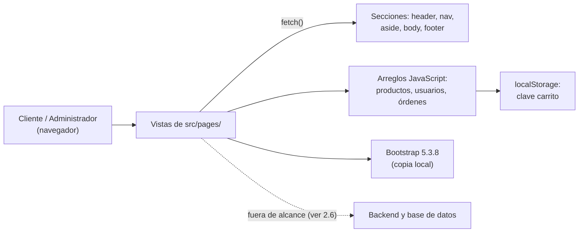
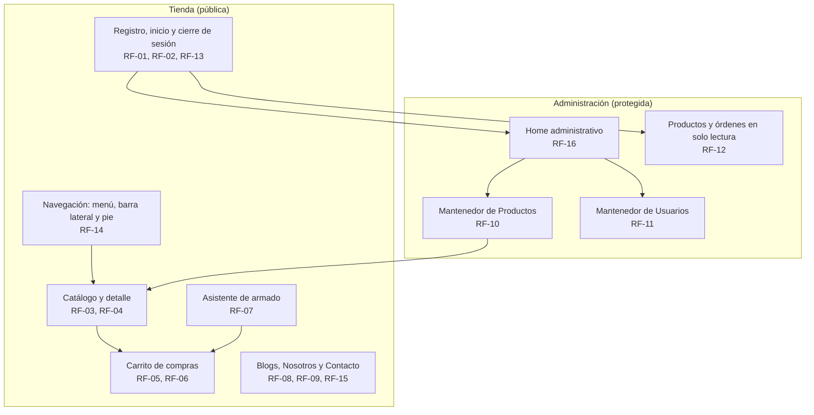

----------------------------------------------------------------------- DUOC UC
- Escuela de Informática y Telecomunicaciones
-----------------------------------------------------------------------
Especificación de Requisitos de Software

*Proyecto:* Ensambla.me – Tienda Online de Tecnología

**Revisión: 1.7**

**Autor:** Daniel Muñoz

**29-09-2026**
-----------------------------------------------------------------------

-----------------------------------------------------------------------
Especificación de Requisitos según estándar de IEEE 830.
-----------------------------------------------------------------------

# Contenido

- [Ficha del documento](#ficha-del-documento)
- [1. Introducción](#1-introducción)
  - [1.1. Propósito](#11-propósito)
  - [1.2. Ámbito del Sistema](#12-ámbito-del-sistema)
  - [1.3. Definiciones, Acrónimos y Abreviaturas](#13-definiciones-acrónimos-y-abreviaturas)
  - [1.4. Referencias](#14-referencias)
  - [1.5. Visión General del Documento](#15-visión-general-del-documento)
- [2. Descripción General](#2-descripción-general)
  - [2.1. Perspectiva del Producto](#21-perspectiva-del-producto)
  - [2.2. Funciones del Producto](#22-funciones-del-producto)
  - [2.3. Características de los Usuarios](#23-características-de-los-usuarios)
  - [2.4. Restricciones](#24-restricciones)
  - [2.5. Suposiciones y Dependencias](#25-suposiciones-y-dependencias)
  - [2.6. Requisitos Futuros](#26-requisitos-futuros)
- [3. Requisitos Específicos](#3-requisitos-específicos)
  - [3.1 Requisitos comunes de las interfaces](#31-requisitos-comunes-de-las-interfaces)
    - [3.1.1 Interfaces de usuario](#311-interfaces-de-usuario)
    - [3.1.2 Interfaces de hardware](#312-interfaces-de-hardware)
    - [3.1.3 Interfaces de software](#313-interfaces-de-software)
    - [3.1.4 Interfaces de comunicación](#314-interfaces-de-comunicación)
  - [3.2 Requisitos funcionales](#32-requisitos-funcionales)
  - [3.3 Requisitos no funcionales](#33-requisitos-no-funcionales)
    - [3.3.1 Requisitos de rendimiento](#331-requisitos-de-rendimiento)
    - [3.3.2 Seguridad](#332-seguridad)
    - [3.3.3 Fiabilidad](#333-fiabilidad)
    - [3.3.4 Disponibilidad](#334-disponibilidad)
    - [3.3.5 Mantenibilidad](#335-mantenibilidad)
    - [3.3.6 Portabilidad](#336-portabilidad)
  - [3.4 Otros Requisitos](#34-otros-requisitos)
  - [3.5 Modelo de datos lógico](#35-modelo-de-datos-lógico)
- [4. Historias de Usuario y Criterios de Aceptación](#4-historias-de-usuario-y-criterios-de-aceptación)
  - [4.1 Historias de acceso y autenticación](#41-historias-de-acceso-y-autenticación)
  - [4.2 Historias de la tienda](#42-historias-de-la-tienda)
  - [4.3 Historias de administración](#43-historias-de-administración)
  - [4.4 Criterios de aceptación de los requisitos no funcionales](#44-criterios-de-aceptación-de-los-requisitos-no-funcionales)
- [5. Trazabilidad de requisitos](#5-trazabilidad-de-requisitos)

# Ficha del documento

| **Fecha**  | **Revisión** | **Autor**    | **Modificación**                                     |
|------------|--------------|--------------|------------------------------------------------------|
| 24-09-2026 | 1.0          | Daniel Muñoz | Versión inicial del ERS (Entrega I)                  |
| 29-09-2026 | 1.1          | Daniel Muñoz | Corrección de inconsistencias y requisitos faltantes |
| 29-09-2026 | 1.2          | Daniel Muñoz | Historias de usuario, criterios de aceptación y trazabilidad |
| 29-09-2026 | 1.3          | Daniel Muñoz | Historias de usuario y criterios de aceptación en sección propia |
| 29-09-2026 | 1.4          | Daniel Muñoz | Conformidad con Anexos 1 y 4 y con la pauta de Evaluación Parcial N° 1 |
| 29-09-2026 | 1.5          | Daniel Muñoz | Reducción de redundancia y compactación del documento |
| 29-09-2026 | 1.6          | Daniel Muñoz | Sugerencias de validación, HTML válido, barra lateral y herramientas |
| 29-09-2026 | 1.7          | Daniel Muñoz | Modelo de datos lógico, diagramas y trazabilidad hacia delante |

Documento validado por las partes en fecha: *pendiente de presentación (Entrega
I)*.

| Por el cliente               | Por la empresa suministradora |
|------------------------------|-------------------------------|
| [Firma]                      | [Firma]                       |
| Sr./Sra. — Docente evaluador | Sr./Sra. Daniel Muñoz         |

# 1. Introducción

Esta sección introduce el documento de Especificación de Requisitos de Software
(ERS) para **Ensambla.me**, tienda online de artículos tecnológicos. Consta de
las subsecciones: propósito, ámbito del sistema, definiciones, referencias y
visión general del documento.

## 1.1. Propósito

El propósito de este documento es describir de forma detallada los requisitos
funcionales y no funcionales del sitio web **Ensambla.me**, una tienda online de
productos tecnológicos que además ofrece un asistente de armado guiado de PC
gamer por componentes, en su primera versión (Entrega I de la Evaluación Parcial
N° 1 de la asignatura Desarrollo Fullstack II, DSY1104).

El documento está dirigido al docente evaluador de la asignatura, y sirve además
como referencia interna para el desarrollador durante la construcción del sitio
y en evaluaciones futuras del mismo proyecto. El proyecto se desarrolla de forma
individual por un único estudiante, modalidad autorizada por el docente de la
asignatura.

## 1.2. Ámbito del Sistema

El sistema se denomina **Ensambla.me** y consiste en un sitio web que guía al
cliente en la construcción de su PC gamer, permitiéndole escoger paso a paso los
componentes hasta completar el equipo entero o bien solo módulos específicos.

En esta primera entrega, el sistema:

- **Sí hará:** ofrecer una tienda pública con catálogo de productos y su
  detalle, blogs, información de la empresa y contacto; el registro, inicio y
  cierre de sesión de usuarios; el asistente de armado de PC gamer, completo o
  por módulos; y un carrito de compras gestionable. Sobre esa tienda ofrece un
  panel administrativo protegido con mantenedores de Productos y Usuarios y la
  consulta en solo lectura de órdenes simuladas. El detalle de cada función está
  en 2.2.
- **No hará (en esta entrega):** procesar pagos reales, conectarse a una base de
  datos o backend real, ni gestionar el ciclo completo de una orden de compra
  (despacho, facturación, etc.). Tampoco validará la compatibilidad técnica real
  entre componentes: el asistente filtra cada categoría según la tabla de
  compatibilidad estática (ver 1.3) y el motor de validación real queda como
  requisito futuro (ver 2.6). Las restricciones técnicas de la implementación se
  detallan en 2.4.

Los beneficios esperados son: contar con una base funcional y bien estructurada
(HTML semántico, CSS propio y responsivo, validaciones JS) que sirva de
fundamento para incorporar en evaluaciones posteriores un backend real, base de
datos y pasarela de pago.

## 1.3. Definiciones, Acrónimos y Abreviaturas

- **ERS**: Especificación de Requisitos de Software.
- **Historia de usuario**: enunciado breve, en lenguaje del cliente, con el
  formato "Como <rol>, quiero <acción> para <beneficio>".
- **Criterio de aceptación**: condición verificable de un requisito; si describe
  un flujo, en formato Dado / Cuando / Entonces.
- **Prioridad**: importancia de un requisito en la sección 5: *Esencial*,
  *Condicional* u *Opcional*, según qué fuente lo exija.
- **RUN**: Rol Único Nacional, identificador de personas en Chile; se ingresa
  sin puntos ni guion (ej. `19011022K`) y se valida su dígito verificador.
- **Dominios permitidos**: únicos dominios de correo aceptados por cualquier
  campo de correo del sistema: `@duoc.cl`, `@profesor.duoc.cl` y `@gmail.com`.
- **Código de producto (SKU)**: identificador de texto único de cada producto
  del catálogo.
- **Armado (build)**: conjunto de componentes seleccionados con el asistente de
  armado para configurar una PC gamer, completa o por módulos.
- **Módulo**: subconjunto de categorías de componentes (ej. solo almacenamiento)
  que el cliente puede armar sin construir el equipo completo.
- **Componente**: cada pieza de hardware seleccionable dentro de un armado,
  según las categorías que enumera RF-07.
- **Tabla de compatibilidad**: estructura estática en los arreglos JS que asocia
  cada componente con los admisibles de la siguiente categoría.
- **Carrito de compras**: estructura de datos en JavaScript con los productos
  seleccionados por el cliente antes de finalizar una compra.
- **Orden**: registro simulado de una compra (cliente, fecha, productos y total)
  en un arreglo JavaScript, disponible solo en modo lectura en esta entrega.
- **LocalStorage**: almacenamiento del navegador (Web Storage API) usado para
  persistir el contenido del carrito entre sesiones.
- **Stock crítico**: cantidad mínima de unidades de un producto a partir de la
  cual el sistema muestra una alerta de bajo inventario.
- **CRUD**: Crear, Leer (listar), Actualizar y Eliminar.
- **Mantenedor**: vista administrativa que implementa las operaciones CRUD de
  una entidad (Producto o Usuario), salvo Eliminar (ver 2.6).

## 1.4. Referencias

- Anexo 1 — Instrucciones para el desarrollo de la Evaluación 1 (30%),
  incluyendo mockups de cada vista.
- Anexo 2 — Planilla de Requerimientos (guía de columnas para el seguimiento de
  requisitos).
- Anexo 3 — Ejemplo de Planilla de Requerimientos.
- Anexo 4 — Plantilla ERS - Especificación de Requisitos del Software (IEEE
  830), base de este documento.
- Pauta de la Evaluación Parcial N° 1 — «Construyendo las bases para mi
  aplicación web»: situaciones evaluativas, indicadores de evaluación (IE) y
  ponderaciones de la asignatura Desarrollo Fullstack II (DSY1104).

## 1.5. Visión General del Documento

Este documento consta de un área de definición del negocio (sección 2,
Descripción General), un área de especificación de requisitos (sección 3,
Requisitos Específicos), donde se detallan los requisitos funcionales mediante
fichas, los requisitos no funcionales del sistema y el modelo de datos lógico
que sustenta a ambos, una sección de historias de usuario y criterios de
aceptación (sección 4) y una tabla de trazabilidad que relaciona todos los
requisitos con sus historias, actores, vistas y archivos (sección 5).

La subsección 3.5 y las secciones 4 y 5 son adiciones a la plantilla del Anexo
4, que concluye en 3.4: la primera recoge la especificación de los requisitos
lógicos de la información almacenada que pide su sección 3.2, y las dos últimas
se incorporan para satisfacer los principios de requisitos verificables y
trazables enunciados en su sección 3. Por la misma razón los requisitos se
identifican con códigos estables RF-xx y RNF-xx en lugar de la numeración 3.2.n
de la plantilla, conforme a la exigencia de que todo requisito sea unívocamente
identificable mediante un código adecuado.

La pauta de la Evaluación Parcial N° 1 exige que el ERS cubra tres bloques de
contenido: los requerimientos (secciones 3 y 4, con su trazabilidad en la 5),
las herramientas (2.1, 2.4 y 3.1.3) y las propuestas del proyecto (1.2, 2.2 y
2.6).

# 2. Descripción General

Esta sección describe los factores que afectan al producto **Ensambla.me** y a
sus requisitos, sin detallar aún los requisitos en sí (eso se hace en la sección
3).

## 2.1. Perspectiva del Producto

Ensambla.me es un producto independiente: un sitio web frontend (HTML, CSS y
JavaScript puro, apoyado en el framework Bootstrap para estilos y componentes)
que no depende de ni se integra con otros sistemas externos en esta entrega. No
existe backend ni base de datos; toda la información de productos, usuarios,
órdenes y carrito se maneja del lado del cliente (arreglos JavaScript y
`localStorage`).

Además del catálogo tradicional, Ensambla.me se diferencia por incorporar un
asistente de armado por componentes que guía al cliente, categoría por
categoría, en la construcción de una PC gamer completa o por módulos.

La estructura del `index.html` referencia archivos separados por sección
(encabezado, navegación, aside, cuerpo, pie de página). El script
`src/scripts/includes.js` resuelve los atributos `[data-include]` al producirse
el evento `DOMContentLoaded` y solicita cada archivo mediante `fetch()`, lo que
obliga a servir el proyecto por HTTP (ver 3.1.4).

El siguiente diagrama de bloques resume el producto y su entorno:



## 2.2. Funciones del Producto

Las funciones del sistema se agrupan en dos grandes áreas:

El siguiente diagrama muestra esos grupos de funciones y sus relaciones:



**Tienda (pública):**
- Navegación entre páginas mediante menú superior con logo y acceso al carrito,
  y barra lateral con accesos a las categorías del catálogo en las vistas de
  tienda.
- Visualización de catálogo de productos (imagen, nombre, precio) y su detalle.
- Asistente de armado de PC gamer (*Ensambla.me*): selección guiada de
  componentes por categoría (CPU, placa madre, RAM, almacenamiento, fuente de
  poder, gabinete, refrigeración, tarjeta gráfica, periféricos), donde elegir un
  componente filtra las opciones admisibles de la siguiente categoría según la
  tabla de compatibilidad; permite armar el equipo completo o trabajar solo por
  módulos (ej. solo actualizar almacenamiento) y agregar el armado resultante al
  carrito.
- Carrito de compras: agregar productos, eliminar ítems, modificar cantidades,
  ver el total y persistencia en `localStorage`.
- Registro de nuevos usuarios, inicio de sesión y cierre de sesión.
- Página "Nosotros" con información de la empresa y desarrolladores.
- Sección de blogs con listado y detalle de artículos.
- Formulario de contacto para envío de mensajes internos.

**Administración (protegida):**
- Autenticación y control de acceso según rol de usuario.
- Home administrativo con menú vertical.
- Mantenedor de Productos: listar, crear y editar.
- Mantenedor de Usuarios: listar, crear y editar.
- Vista de solo lectura de productos y órdenes para el rol Administrador
  logístico.

## 2.3. Características de los Usuarios

El sistema contempla tres tipos de perfiles de usuario:

- **Administrador**: acceso total al sistema, incluyendo los mantenedores de
  Producto y Usuario. Se espera un nivel de manejo de PC a nivel de usuario, sin
  necesidad de conocimientos técnicos avanzados.
- **Administrador logístico** (denominado *Vendedor* en el Anexo 1; en este
  proyecto se renombra para reflejar con mayor precisión su función): solo puede
  visualizar el listado y detalle de productos, y el listado y detalle de
  órdenes. No tiene acceso a ninguna otra funcionalidad administrativa. Se
  espera un nivel de manejo de PC básico.
- **Cliente**: usuario de la tienda pública; puede registrarse, iniciar sesión,
  navegar el catálogo, comprar (agregar al carrito) y contactar a la empresa. No
  se requiere ningún conocimiento técnico particular, solo el uso habitual de un
  navegador web.

## 2.4. Restricciones

- El sistema debe construirse únicamente con HTML, CSS y JavaScript puro, más el
  framework Bootstrap para estilos/componentes (sin frameworks adicionales de
  JavaScript en esta entrega).
- No debe utilizarse backend ni base de datos real en esta entrega; los datos se
  simulan en arreglos JavaScript y `localStorage`.
- El diseño debe ser responsivo y consistente en todas las páginas mediante una
  hoja de estilos CSS externa y propia.
- El proyecto debe versionarse con Git y publicarse en un repositorio público de
  GitHub, con commits claros y descriptivos.
- Las vistas administrativas deben estar protegidas mediante un mecanismo de
  autenticación (aunque sea simulado del lado del cliente en esta entrega).
- El sitio debe ejecutarse detrás de un servidor HTTP y no abrirse como archivo
  local (ver 3.1.4).

## 2.5. Suposiciones y Dependencias

- Se asume que el usuario accede desde un navegador web moderno con soporte de
  `localStorage`, Fetch API y JavaScript habilitado.
- Se asume que los datos de productos, usuarios y órdenes de prueba (arreglos
  JS) son representativos para efectos de la demostración, y que no se requiere
  persistencia real entre distintos dispositivos o usuarios.
- Si en evaluaciones futuras se incorpora un backend y base de datos real,
  varios requisitos actuales (especialmente los relacionados con persistencia de
  carrito, productos y usuarios) deberán revisarse y actualizarse.

## 2.6. Requisitos Futuros

- Incorporación de un backend real con base de datos para persistir productos,
  usuarios y órdenes.
- Integración de una pasarela de pago para completar el flujo de compra.
- Gestión completa de órdenes (estado del pedido, historial de compras del
  cliente).
- Operación Eliminar en los mantenedores de Producto y Usuario, completando el
  CRUD definido en 1.3; el Anexo 1 la menciona al describir el sistema de
  gestión, pero no la exige en los mockups de mantenedor, que solo definen el
  listado y la creación.
- Panel de reportes y estadísticas para el rol Administrador.
- Recuperación de contraseña y verificación de correo electrónico en el
  registro.
- Motor de validación automática de la compatibilidad técnica real entre
  componentes del armado (socket de CPU, tipo de memoria RAM, formato de
  gabinete, potencia de la fuente de poder), en reemplazo de la tabla de
  compatibilidad estática de esta entrega.

# 3. Requisitos Específicos

Esta sección detalla los requisitos de Ensambla.me con el nivel de detalle
suficiente para diseñar e implementar el sistema, y para que puedan verificarse
una vez construido.

## 3.1 Requisitos comunes de las interfaces

### 3.1.1 Interfaces de usuario

Las interfaces de usuario serán páginas web con una distribución de menú
superior (navegación, logo y carrito), un área de contenido central para mostrar
la funcionalidad de cada vista y, en las vistas de tienda, una barra lateral con
accesos a las categorías del catálogo. El panel de administración utiliza además
un menú lateral vertical. El asistente de armado se presenta como un flujo
guiado paso a paso (una categoría de componente a la vez) dentro del área de
contenido. El diseño es responsivo y consistente en todas las páginas gracias a
una hoja de estilos CSS externa y a los componentes de Bootstrap.

### 3.1.2 Interfaces de hardware

El sistema debe poder visualizarse y utilizarse correctamente desde un
dispositivo táctil móvil (smartphone o tablet), además de computadores de
escritorio, gracias al diseño responsivo.

### 3.1.3 Interfaces de software

- **Bootstrap 5.3.8 (CSS y JS)**: framework utilizado para estilos, componentes
  de interfaz (menús, formularios, botones) y comportamiento responsivo. Se
  declara como dependencia npm en `package.json` y se distribuye en el proyecto
  como copia local en `src/bootstrap/`, de modo que el sitio no dependa de una
  CDN.
- **Fetch API**: utilizada por `src/scripts/includes.js` para solicitar,
  mediante peticiones HTTP GET del mismo origen, los archivos HTML de cada
  sección (encabezado, navegación, aside, cuerpo, pie de página) y componer así
  cada página del sitio.
- **Web Storage API (`localStorage`)**: utilizada para persistir el contenido
  del carrito de compras en el navegador del cliente, bajo una única clave
  `carrito` cuyo valor es un arreglo serializado en JSON con una entrada por
  ítem (producto individual o armado) y su cantidad.

### 3.1.4 Interfaces de comunicación

El sistema no consume APIs externas ni servicios de terceros: toda la lógica de
negocio se ejecuta en el navegador del cliente. Sin embargo, no se trata de un
sitio que pueda abrirse como archivo local: realiza peticiones **HTTP GET del
mismo origen** para cargar sus propios fragmentos HTML mediante `fetch()`, por
lo que debe publicarse o ejecutarse detrás de un servidor HTTP. Para desarrollo
local basta, por ejemplo, con:

```
python3 -m http.server 8000
```

y abrir `http://localhost:8000/src/pages/index.html`. Abierto con el esquema
`file://`, el navegador bloquea esas peticiones y las secciones de la página no
se cargan.

## 3.2 Requisitos funcionales

Cada requisito funcional se especifica mediante una ficha con su código y
nombre, los actores involucrados y la descripción del comportamiento esperado.
La historia de usuario y los criterios de aceptación de cada requisito se
encuentran en la sección 4, y la tabla de trazabilidad que relaciona ambos
conjuntos es la sección 5. Los códigos RF-xx son identificadores estables: no se
reutilizan ni se renumeran al agregar nuevos requisitos.

> **RF-01 — Registrar usuario**
>
> Actores: Cliente
>
> Descripción: El cliente debe poder registrarse en el sistema completando un
> formulario con RUN (requerido, sin puntos ni guion, mín. 7, máx. 9, validando
> el dígito verificador), nombre (requerido, máx. 50), apellidos (requerido,
> máx. 100), correo (requerido, máx. 100, restringido a los dominios permitidos
> definidos en 1.3), contraseña (requerida, entre 4 y 10 caracteres, enmascarada
> en pantalla, misma regla que el inicio de sesión de RF-02), fecha de
> nacimiento (opcional), región y comuna (requeridas, seleccionadas desde
> arreglos JS, la comuna se actualiza al cambiar la región) y dirección
> (requerida, máx. 300). Estas son las mismas reglas usadas por el mantenedor
> "Crear usuario" del administrador (RF-11).
>
> Nota: el Anexo 1 no incluye el campo contraseña en su lista de campos de
> usuario, aunque sí lo exige en el inicio de sesión; se define como requerido
> en el registro por decisión del proyecto, dado que sin él no es posible
> autenticar al usuario.

> **RF-02 — Iniciar sesión**
>
> Actores: Cliente, Administrador logístico, Administrador
>
> Descripción: El usuario debe poder iniciar sesión con correo (requerido, máx.
> 100, restringido a los dominios permitidos definidos en 1.3) y contraseña
> (requerida, entre 4 y 10 caracteres). Según el tipo de usuario autenticado, el
> sistema debe redirigir y habilitar las funcionalidades correspondientes a su
> rol.

> **RF-03 — Visualizar catálogo de productos**
>
> Actores: Cliente
>
> Descripción: El cliente debe poder ver, en la página de inicio y en la página
> de productos, un listado de productos con imagen, nombre y precio, generado
> dinámicamente desde un arreglo de JavaScript. Además, la página de inicio debe
> presentar un componente principal que muestre la información e imagen de la
> tienda, por sobre el listado de productos.

> **RF-04 — Ver detalle de producto**
>
> Actores: Cliente
>
> Descripción: Al hacer clic sobre un producto del listado, el cliente debe ser
> redirigido a una vista de detalle del producto, donde puede añadirlo al
> carrito de compras. La vista de detalle debe mostrar además un video embebido
> del producto cuando este define uno en el campo opcional `video` del arreglo
> de productos (ver RF-10); si el producto no define video, la vista no debe
> dejar un contenedor vacío en su lugar.

> **RF-05 — Agregar producto al carrito**
>
> Actores: Cliente
>
> Descripción: El cliente debe poder agregar un producto al carrito de compras
> desde la vista de listado de productos o desde el detalle de producto.

> **RF-06 — Gestionar carrito de compras**
>
> Actores: Cliente
>
> Descripción: El cliente debe poder visualizar el contenido del carrito de
> compras, eliminar un producto del carrito, modificar la cantidad de un ítem y
> ver el total calculado a partir de los precios y las cantidades. El carrito se
> implementa como un arreglo de productos en JavaScript, se renderiza desde
> dicho arreglo, y su contenido se persiste en `localStorage` para mantenerse
> entre sesiones.

> **RF-07 — Armar PC gamer por componentes**
>
> Actores: Cliente
>
> Descripción: El cliente debe poder utilizar el asistente de armado
> (*Ensambla.me*) para construir una PC gamer seleccionando, categoría por
> categoría (CPU, placa madre, RAM, almacenamiento, fuente de poder, gabinete,
> refrigeración, tarjeta gráfica, periféricos), los componentes deseados. Al
> seleccionar un componente, el sistema debe filtrar las opciones de la
> siguiente categoría según la tabla de compatibilidad estática definida en los
> arreglos JavaScript (ver 1.3); no se realiza ningún cálculo de compatibilidad
> técnica real, lo que queda como requisito futuro (ver 2.6). El cliente puede
> optar por completar el armado de todas las categorías (equipo completo) o
> seleccionar solo algunos módulos de forma independiente (ej. solo
> almacenamiento). Al finalizar, el cliente puede agregar el conjunto de
> componentes armado al carrito de compras.

> **RF-08 — Enviar mensaje de contacto**
>
> Actores: Cliente
>
> Descripción: El cliente debe poder enviar un mensaje interno a la empresa
> mediante un formulario de contacto con nombre (requerido, máx. 100), correo
> (requerido, máx. 100, restringido a los dominios permitidos definidos en 1.3)
> y comentario (requerido, máx. 500).
>
> Nota: el Anexo 1 no marca el correo como obligatorio en este formulario; se
> exige como requerido por decisión del proyecto, dado que sin él la empresa no
> puede responder el mensaje.

> **RF-09 — Consultar blogs**
>
> Actores: Cliente
>
> Descripción: El cliente debe poder visualizar un listado de artículos de blog
> (imagen, título, descripción corta) y acceder al detalle de al menos dos
> artículos (imagen, título, descripción larga).

> **RF-10 — Mantenedor de Productos**
>
> Actores: Administrador
>
> Descripción: El administrador debe poder listar todos los productos, crear un
> nuevo producto y editar uno existente, ingresando: código de producto (SKU)
> (requerido, texto, mín. 3 caracteres, sin límite superior), nombre (requerido,
> máx. 100), descripción (opcional, máx. 500), precio (requerido, mín. 0 —un
> valor 0 se considera un producto gratuito—, sin límite superior, admite
> decimales), stock (requerido, mín. 0, sin límite superior, solo enteros),
> stock crítico (opcional, mín. 0, solo enteros, muestra alerta cuando el stock
> sea igual o inferior a este valor), categoría (requerida, mediante select),
> imagen (opcional) y video (opcional, URL de un video embebido que se muestra
> en el detalle del producto, ver RF-04).
>
> Nota: el campo video no figura en la lista de campos de producto del Anexo 1;
> se agrega por decisión del proyecto para dar soporte mantenible al video
> embebido que exige el indicador IE1.1.1 de la pauta de evaluación.

> **RF-11 — Mantenedor de Usuarios**
>
> Actores: Administrador
>
> Descripción: El administrador debe poder listar todos los usuarios, crear un
> nuevo usuario y editar uno existente, con las mismas reglas de campos que
> RF-01 (incluidos RUN y contraseña), más un campo adicional de tipo de usuario
> (select: Administrador, Cliente o Administrador logístico), visible solo en
> esta vista administrativa.
>
> Nota: el campo contraseña tampoco figura en la lista de campos de usuario del
> Anexo 1; se mantiene aquí por consistencia con RF-01, ya que este mantenedor
> crea las mismas cuentas con que opera el inicio de sesión.

> **RF-12 — Visualizar productos y órdenes (rol Administrador logístico)**
>
> Actores: Administrador logístico
>
> Descripción: El administrador logístico debe poder visualizar el listado y
> detalle de productos, y el listado y detalle de órdenes, en modo de solo
> lectura. Ninguna otra funcionalidad administrativa debe estar visible ni
> accesible para este rol.

> **RF-13 — Cerrar sesión**
>
> Actores: Cliente, Administrador logístico, Administrador
>
> Descripción: El usuario autenticado debe poder cerrar su sesión desde
> cualquier vista. El sistema debe limpiar los datos de sesión almacenados en el
> cliente y redirigir a la tienda pública, de modo que las vistas
> administrativas vuelvan a quedar inaccesibles (ver 3.3.2).

> **RF-14 — Navegar el sitio**
>
> Actores: Cliente
>
> Descripción: Todas las vistas públicas deben presentar un menú superior de
> navegación con el logo de la tienda, enlaces a Inicio, Productos, Blogs,
> Nosotros y Contacto, y un acceso al carrito de compras que muestre la cantidad
> de ítems que contiene. Las vistas de tienda deben presentar además una barra
> lateral de navegación con accesos a las categorías del catálogo (ver 3.3.5).
> Todas las vistas deben presentar además un pie de página informativo con el
> nombre de la tienda, los enlaces de navegación principales, los datos de
> contacto de la empresa y el año, resuelto desde un único archivo compartido
> (ver 3.3.5).

> **RF-15 — Consultar información de la empresa**
>
> Actores: Cliente
>
> Descripción: El cliente debe poder acceder a la vista "Nosotros", donde se
> describe de qué se trata la empresa y quiénes son sus desarrolladores.

> **RF-16 — Acceder al home administrativo**
>
> Actores: Administrador
>
> Descripción: Tras autenticarse, el administrador debe acceder a una vista de
> inicio del panel administrativo con un menú vertical visible que permita
> navegar a los mantenedores de Productos y Usuarios. Esta vista no debe ser
> accesible sin autenticación previa (ver 3.3.2).

## 3.3 Requisitos no funcionales

Los criterios de aceptación verificables de cada uno de los requisitos de esta
sección se detallan en la sección 4.4.

### 3.3.1 Requisitos de rendimiento

Al tratarse de un sitio estático sin backend, cada vista debe cargar
completamente en menos de 2 segundos en una conexión de banda ancha estándar,
dado que no existen llamadas a servicios externos ni consultas a base de datos
en esta entrega.

### 3.3.2 Seguridad

- Todas las contraseñas ingresadas en los formularios deben enmascararse (tipo
  `password`) en pantalla, tanto en el inicio de sesión como en el registro y en
  el mantenedor de Usuarios.
- Las vistas del panel administrativo deben quedar inaccesibles para un usuario
  que no haya iniciado sesión y también para un usuario autenticado con rol
  Cliente, cuyo acceso se limita a la tienda pública.
- Las funcionalidades visibles para el rol Administrador logístico deben
  restringirse a únicamente productos y órdenes en modo lectura; el resto de
  opciones administrativas no debe renderizarse para este rol.
- El cierre de sesión (RF-13) debe limpiar los datos de sesión del cliente, de
  modo que las vistas administrativas dejen de ser accesibles.
- Todos los formularios (registro, login, contacto, producto, usuario) deben
  validarse en tiempo real en el cliente, mostrando mensajes de error y
  sugerencias personalizados antes de permitir el envío.
- Además del mensaje de error, cada campo validado debe ofrecer una sugerencia
  que anticipe el formato esperado (por ejemplo el formato del RUN o los
  dominios de correo aceptados), visible antes de que el usuario cometa el
  error.

### 3.3.3 Fiabilidad

Al no depender de un backend, el sistema no debe presentar errores de carga de
página bajo uso normal del navegador; los únicos incidentes esperables
corresponden a errores de validación de formularios, que deben ser gestionados y
comunicados claramente al usuario sin interrumpir la navegación.

### 3.3.4 Disponibilidad

Al ser un sitio 100% estático (sin servidor de aplicación ni base de datos), la
disponibilidad depende únicamente del servicio de hosting/repositorio utilizado
para publicarlo. El proyecto no compromete un porcentaje propio de
disponibilidad: el exigible es el que ofrezca el servicio de hosting elegido, ya
que ningún componente del sistema puede degradarla.

### 3.3.5 Mantenibilidad

El sitio debe mantenerse mediante la separación de cada sección de la página
(encabezado, navegación, aside, cuerpo, pie de página) en archivos HTML
independientes referenciados desde `index.html`, y mediante una hoja de estilos
CSS externa única. El mantenimiento (agregar productos de prueba, ajustar
validaciones, etc.) puede ser realizado directamente por el desarrollador
editando estos archivos, bajo demanda y sin ventanas programadas, dado que el
sitio no almacena datos de producción que obliguen a detenerlo.

Cada vista debe construirse con etiquetado HTML5 semántico —`<header>`, `<nav>`,
`<main>`, `<section>`, `<article>` y `<footer>`— en lugar de contenedores
`<div>` genéricos, de modo que la estructura del documento sea autodescriptiva y
las secciones compartidas puedan reemplazarse sin ambigüedad. El contenido
textual debe estructurarse con una jerarquía de encabezados, párrafos y listas,
y no con saltos de línea o estilos que los imiten. Del mismo modo, cada control
de formulario debe tener su etiqueta `<label>` asociada mediante el atributo
`for` y declarar el atributo `autocomplete` que corresponda al dato solicitado,
de manera que el marcado exprese por sí mismo el propósito de cada campo. El
comportamiento de las validaciones se especifica en 3.3.2, y el marcado de cada
vista debe validar sin errores contra el validador del W3C.

### 3.3.6 Portabilidad

El sistema debe funcionar correctamente en cualquier navegador web moderno
(Chrome, Firefox, Edge) sin depender de un sistema operativo, compilador o
plataforma de desarrollo específica, dado que utiliza únicamente HTML, CSS,
JavaScript y Bootstrap. La única condición de ejecución es servirlo mediante un
servidor HTTP (ver 3.1.4).

## 3.4 Otros Requisitos

- El proyecto debe mantenerse en un repositorio Git/GitHub público, con
  historial de commits claros y coherentes que documenten el avance del
  desarrollo, ya que este historial será evaluado como parte de la ronda de
  preguntas de la Entrega I.
- El repositorio debe documentar cómo ejecutar el proyecto localmente
  (`python3 -m http.server 8000` y luego
  `http://localhost:8000/src/pages/index.html`), que es un prerrequisito de
  ejecución y no una comodidad (ver 3.1.4).
- El proyecto es desarrollado de forma individual por un único estudiante,
  modalidad autorizada por el docente de la asignatura; en consecuencia, el
  historial del repositorio refleja el avance de un solo autor y no una
  distribución de tareas entre integrantes de un equipo.
- Además del enlace al repositorio público, la entrega incluye el proyecto
  frontend comprimido y este documento ERS, conforme a los entregables definidos
  en el Anexo 1 y en la pauta de la Evaluación Parcial N° 1.

## 3.5 Modelo de datos lógico

Esta sección especifica los requisitos lógicos de la información que el sistema
almacena —tipo de dato y obligatoriedad de cada campo—, como pide la sección 3.2
de la plantilla del Anexo 4, y anticipa el modelo de la base de datos que el
Anexo 1 proyecta para las entregas siguientes. Las fichas de 3.2 siguen siendo
la fuente normativa de las reglas de validación y de los límites de cada campo:
las tablas indican el tipo y la obligatoriedad, y remiten al requisito
correspondiente en lugar de repetir esos límites. En esta entrega ninguna
entidad reside en una base de datos, sino en arreglos JavaScript, y el carrito
se serializa además en la clave `carrito` de `localStorage` (ver 3.1.3).

**Producto** (RF-03, RF-04, RF-10)

| Campo                    | Tipo             | Requerido | Notas                                  |
|--------------------------|------------------|-----------|----------------------------------------|
| código de producto (SKU) | Texto            | Sí        | Clave de la entidad; reglas en RF-10   |
| nombre                   | Texto            | Sí        | —                                      |
| descripción              | Texto            | No        | Se muestra en el detalle (RF-04)       |
| precio                   | Decimal ≥ 0      | Sí        | Un valor 0 es un producto gratuito     |
| stock                    | Entero ≥ 0       | Sí        | Unidades en inventario                 |
| stock crítico            | Entero ≥ 0       | No        | Umbral de la alerta de bajo inventario |
| categoría                | Conjunto cerrado | Sí        | Se escoge mediante select              |
| imagen                   | URL              | No        | —                                      |
| video                    | URL              | No        | Video embebido del detalle (RF-04)     |

**Usuario** (RF-01, RF-02, RF-11)

| Campo               | Tipo                                             | Requerido | Notas                                                    |
|---------------------|--------------------------------------------------|-----------|----------------------------------------------------------|
| RUN                 | Texto                                            | Sí        | Clave de la entidad; se valida el dígito verificador     |
| nombre              | Texto                                            | Sí        | —                                                        |
| apellidos           | Texto                                            | Sí        | —                                                        |
| correo              | Texto                                            | Sí        | Dominios permitidos (ver 1.3); credencial de RF-02       |
| contraseña          | Texto                                            | Sí        | Se presenta enmascarada (ver 3.3.2); credencial de RF-02 |
| fecha de nacimiento | Fecha                                            | No        | —                                                        |
| región              | Conjunto cerrado                                 | Sí        | Se escoge desde el arreglo de regiones; ver Nota         |
| comuna              | Conjunto cerrado                                 | Sí        | Depende de la región escogida; ver Nota                  |
| dirección           | Texto                                            | Sí        | Dirección de despacho                                    |
| tipo de usuario     | Administrador, Cliente o Administrador logístico | Sí        | Determina el acceso (ver 3.3.2); editable solo en RF-11  |

**Orden** (RF-12)

| Campo           | Tipo                       | Requerido | Notas                                    |
|-----------------|----------------------------|-----------|------------------------------------------|
| número de orden | Texto                      | Sí        | Clave de la entidad; ver Nota            |
| cliente         | Referencia a Usuario (RUN) | Sí        | —                                        |
| fecha           | Fecha                      | Sí        | Fecha de la compra simulada              |
| productos       | Lista de ítems             | Sí        | Cada ítem con su producto y su cantidad  |
| total           | Decimal                    | Sí        | Suma del precio unitario por la cantidad |

**Ítem de carrito** (RF-05, RF-06)

| Campo             | Tipo                             | Requerido | Notas                                        |
|-------------------|----------------------------------|-----------|----------------------------------------------|
| producto o armado | Referencia a Producto o a Armado | Sí        | Un armado se trata como un solo ítem         |
| cantidad          | Entero ≥ 1                       | Sí        | Regla de mínimo en HU-06                     |
| subtotal          | Decimal                          | Derivado  | Precio unitario por cantidad; no se almacena |

**Armado** (RF-07)

| Campo       | Tipo                            | Requerido | Notas                                   |
|-------------|---------------------------------|-----------|-----------------------------------------|
| componentes | Lista de referencias a Producto | Sí        | Una por categoría recorrida (ver RF-07) |
| precio      | Decimal                         | Derivado  | Suma del precio de sus componentes      |

La tabla de compatibilidad no es una entidad del negocio, sino una estructura
estática de los arreglos JavaScript que asocia cada componente con la lista de
componentes admisibles de la siguiente categoría (ver 1.3). Las órdenes son de
solo lectura en esta entrega (RF-12): su creación desde el carrito es un
requisito futuro (ver 2.6).

> Nota: el número de orden no figura en la lista de campos del Anexo 1; se
> agrega por decisión del proyecto, porque RF-12 exige un detalle de orden
> navegable y sin una clave no es posible identificar cuál se abre.

> Nota: el Anexo 1 no declara si región y comuna son requeridas. En esta
> revisión se declaran requeridas por decisión del proyecto, por coherencia con
> la dirección de despacho, que sí lo es; RF-01 y HU-01 recogen la regla.

# 4. Historias de Usuario y Criterios de Aceptación

Esta sección reúne, en un único lugar, la motivación y las condiciones de
verificación de todos los requisitos del sistema. Cada historia de usuario se
identifica con un código HU-xx que corresponde uno a uno con el requisito
funcional RF-xx de la sección 3.2, cuya descripción y actores no se repiten
aquí. Los criterios de aceptación son las condiciones verificables que deben
cumplirse para dar por satisfecho el requisito, y son la base con la que se
completa la columna "Criterio de Aceptación" de la Planilla de Requerimientos
(Anexos 2 y 3). La sección 4.4 recoge los criterios de los requisitos no
funcionales, que no se expresan como historias de usuario porque no describen la
acción de un actor.

## 4.1 Historias de acceso y autenticación

Reúne el registro, el inicio y el cierre de sesión, que en la sección 2.2
figuran como una sola función de la tienda y afectan a los tres perfiles de
usuario.

> **HU-01 (RF-01) — Registrar usuario**
>
> Como **cliente**, quiero registrarme en la tienda para guardar mis datos
> personales y de despacho, y no tener que escribirlos en cada compra.
>
> Criterios de aceptación:
>
> 1. Cuando se envía con un campo requerido vacío (RUN, nombre, apellidos,
>    correo, contraseña, región, comuna o dirección), el sistema impide el envío
>    y marca cada campo faltante con su mensaje de error.
> 2. El RUN se acepta sin puntos ni guion, con entre 7 y 9 caracteres y dígito
>    verificador correcto (`19011022K`); uno con puntos, guion o dígito
>    incorrecto (`19.011.022-3`) se rechaza con el error "RUN inválido" y el
>    formulario no se envía.
> 3. Un correo cuyo dominio no está entre los permitidos (`juan@hotmail.com`) se
>    rechaza con un error que indica los dominios aceptados.
> 4. Una contraseña de menos de 4 o más de 10 caracteres se rechaza con su
>    error; el campo se muestra enmascarado en todo momento.
> 5. Cuando se cambia la región seleccionada, el select de comuna se recarga
>    únicamente con las comunas de esa región.
> 6. Los valores que superan los máximos definidos (nombre > 50, apellidos >
>    100, correo > 100, dirección > 300 caracteres) no pueden ingresarse o
>    muestran el error correspondiente.
> 7. Cuando se envía un formulario completo y válido, el usuario se agrega al
>    arreglo de usuarios y se muestra un mensaje de confirmación.
> 8. El campo de correo ofrece los dominios permitidos como sugerencia
>    seleccionable (`datalist`), de modo que puedan completarse sin escribirlos.

> **HU-02 (RF-02) — Iniciar sesión**
>
> Como **usuario registrado**, quiero iniciar sesión con mi correo y contraseña
> para acceder a las funcionalidades que corresponden a mi rol.
>
> Criterios de aceptación:
>
> 1. Cuando el correo y la contraseña coinciden con un usuario del arreglo, la
>    sesión se inicia y se redirige según el rol.
> 2. Iniciada la sesión, el rol Cliente llega a la tienda pública; el rol
>    Administrador, al home administrativo (RF-16); el rol Administrador
>    logístico, a productos y órdenes en solo lectura (RF-12).
> 3. Un correo de dominio no permitido o una contraseña de menos de 4 o más de
>    10 caracteres se rechazan con su error y el formulario no se envía.
> 4. Unas credenciales que no coinciden con ningún usuario producen un mensaje
>    genérico ("correo o contraseña incorrectos"), sin revelar cuál de los dos
>    falló.

> **HU-13 (RF-13) — Cerrar sesión**
>
> Como **usuario autenticado**, quiero cerrar mi sesión para que nadie más pueda
> usar mi cuenta en un equipo compartido.
>
> Criterios de aceptación:
>
> 1. La opción de cerrar sesión está visible en todas las vistas a las que el
>    usuario autenticado tiene acceso.
> 2. Cuando el usuario cierra sesión, los datos de sesión almacenados en el
>    cliente se eliminan y se redirige a la tienda pública.
> 3. Tras cerrar sesión, intentar abrir una vista administrativa por URL directa
>    redirige al inicio de sesión (ver 3.3.2).
> 4. El contenido del carrito guardado en `localStorage` no se elimina al cerrar
>    sesión, ya que en esta entrega el carrito se asocia al navegador y no al
>    usuario.

## 4.2 Historias de la tienda

> **HU-03 (RF-03) — Visualizar catálogo de productos**
>
> Como **cliente**, quiero ver el listado de productos disponibles con su
> imagen, nombre y precio para identificar rápidamente lo que me interesa.
>
> Criterios de aceptación:
>
> 1. Al cargar la página de inicio o la de productos, se renderiza una tarjeta
>    por cada producto del arreglo con su imagen, nombre y precio.
> 2. Cuando se agrega un elemento al arreglo y se recarga la página, la nueva
>    tarjeta aparece sin haber modificado el HTML, lo que demuestra que el
>    listado se genera dinámicamente.
> 3. Los precios se muestran formateados como moneda (pesos chilenos).
> 4. Con el arreglo de productos vacío, la vista muestra un mensaje de "no hay
>    productos disponibles" en lugar de un área en blanco.
> 5. La página de inicio presenta un componente principal con la información y
>    la imagen de la tienda, visible antes del listado de productos.

> **HU-04 (RF-04) — Ver detalle de producto**
>
> Como **cliente**, quiero revisar el detalle de un producto para conocer sus
> características antes de decidir la compra.
>
> Criterios de aceptación:
>
> 1. Al hacer clic sobre un producto del listado se navega al detalle de ese
>    producto y no de otro.
> 2. El detalle muestra imagen, nombre, precio, descripción y categoría del
>    producto seleccionado, e incluye un botón "Añadir al carrito" operativo
>    (RF-05).
> 3. Un código de producto que no existe en el arreglo produce un mensaje de
>    producto no encontrado, en lugar de una vista vacía o un error de
>    JavaScript.
> 4. Dado un producto que define el campo `video`, su detalle lo muestra
>    embebido y reproducible sin salir del sitio; si no lo define, la vista se
>    muestra completa y sin contenedores vacíos.
> 5. Los datos mostrados provienen del arreglo de productos, no del HTML de la
>    vista.

> **HU-05 (RF-05) — Agregar producto al carrito**
>
> Como **cliente**, quiero añadir un producto al carrito desde el listado o
> desde su detalle para no perder el hilo de mi navegación.
>
> Criterios de aceptación:
>
> 1. Al pulsar el botón de añadir, tanto desde el listado como desde el detalle,
>    el producto se agrega al carrito y el contador del menú superior aumenta en
>    uno.
> 2. Un producto que ya está en el carrito incrementa su cantidad en lugar de
>    crear una segunda línea para el mismo producto.
> 3. Cada vez que se añade un producto se muestra una confirmación visual al
>    cliente.
> 4. El contenido del carrito se guarda en `localStorage` de inmediato al
>    añadir.

> **HU-06 (RF-06) — Gestionar carrito de compras**
>
> Como **cliente**, quiero revisar y ajustar el contenido de mi carrito para
> controlar qué voy a comprar y cuánto voy a gastar.
>
> Criterios de aceptación:
>
> 1. Cada línea del carrito muestra imagen, nombre, precio unitario, cantidad y
>    subtotal.
> 2. Al eliminar un ítem, este desaparece del listado y el total se recalcula
>    sin recargar la página.
> 3. Al modificar la cantidad de un ítem se recalculan su subtotal y el total,
>    que corresponde exactamente a la suma de precio unitario por cantidad de
>    todas las líneas; no se permite una cantidad menor que 1.
> 4. Dado un carrito con productos, al recargar la página o cerrar y reabrir el
>    navegador el carrito conserva su contenido (persistencia en
>    `localStorage`).
> 5. Con el carrito vacío se muestra un mensaje indicándolo y el total es 0.

> **HU-07 (RF-07) — Armar PC gamer por componentes**
>
> Como **cliente sin conocimientos técnicos**, quiero que el sitio me guíe
> categoría por categoría al elegir los componentes de mi PC gamer para no
> equivocarme al combinarlos.
>
> Criterios de aceptación:
>
> 1. El asistente presenta las categorías en un orden definido y una categoría a
>    la vez.
> 2. Seleccionado un componente, la siguiente categoría lista solo las opciones
>    asociadas a él en la tabla de compatibilidad.
> 3. Dado un CPU de un socket determinado, la categoría de placa madre no ofrece
>    placas asociadas a otro socket en la tabla.
> 4. En modo módulos, finalizar sin recorrer todas las categorías está permitido
>    y agrega al carrito únicamente los componentes seleccionados.
> 5. Recorridas todas las categorías (equipo completo), al finalizar se agrega
>    al carrito el conjunto completo.
> 6. Un armado agregado al carrito se identifica como un conjunto, muestra el
>    detalle de sus componentes y su precio corresponde a la suma de ellos.
> 7. El sistema no emite ningún juicio de compatibilidad técnica real: si la
>    tabla asocia dos componentes, la combinación se acepta (ver 1.2 y 2.6).

> **HU-08 (RF-08) — Enviar mensaje de contacto**
>
> Como **visitante**, quiero enviar un mensaje a la empresa para resolver dudas
> antes de comprar.
>
> Criterios de aceptación:
>
> 1. Cuando se envía con el nombre, el correo o el comentario vacíos, se impide
>    el envío y se muestra el error en cada campo faltante.
> 2. Un correo de dominio no permitido se rechaza con un error que indica los
>    dominios aceptados.
> 3. Un nombre de más de 100 caracteres o un comentario de más de 500 no pueden
>    ingresarse o muestran el error correspondiente.
> 4. Cuando se envía un formulario válido, se muestra un mensaje de éxito y los
>    campos quedan limpios.

> **HU-09 (RF-09) — Consultar blogs**
>
> Como **cliente**, quiero leer los artículos del blog de la tienda para
> informarme sobre tecnología y novedades.
>
> Criterios de aceptación:
>
> 1. La vista de blogs muestra un listado de artículos, cada uno con imagen,
>    título y descripción corta.
> 2. Al hacer clic en un artículo se abre su detalle con imagen, título y
>    descripción larga.
> 3. Existen al menos dos artículos con detalle navegable.

> **HU-14 (RF-14) — Navegar el sitio**
>
> Como **cliente**, quiero un menú de navegación siempre visible con acceso al
> carrito para moverme por el sitio y saber cuántos ítems llevo.
>
> Criterios de aceptación:
>
> 1. Toda vista pública muestra el menú superior con el logo y los enlaces a
>    Inicio, Productos, Blogs, Nosotros y Contacto; cada enlace navega a su
>    vista y el logo, a la página de inicio.
> 2. El acceso al carrito del menú muestra la cantidad de ítems y se actualiza
>    al agregar o eliminar productos.
> 3. Con un viewport de ancho menor a 768 px el menú colapsa en un botón
>    desplegable y todos sus enlaces siguen siendo accesibles (ver 3.1.2).
> 4. Toda vista pública muestra un pie de página con el nombre de la tienda, los
>    enlaces de navegación principales, los datos de contacto y el año.
> 5. Al modificar el archivo del pie de página el cambio se refleja en todas las
>    vistas, porque todas lo incluyen desde ese mismo archivo.
> 6. Toda vista de tienda muestra la barra lateral con los accesos a las
>    categorías del catálogo, y cada acceso navega al listado de productos.

> **HU-15 (RF-15) — Consultar información de la empresa**
>
> Como **visitante**, quiero conocer quién está detrás de la tienda para decidir
> si le compro con confianza.
>
> Criterios de aceptación:
>
> 1. La vista "Nosotros" es accesible desde el menú superior de cualquier vista
>    pública y contiene una descripción de la empresa y la presentación de sus
>    desarrolladores.
> 2. La vista reutiliza el mismo encabezado, navegación y pie de página que el
>    resto del sitio.

## 4.3 Historias de administración

> **HU-10 (RF-10) — Mantenedor de Productos**
>
> Como **administrador**, quiero mantener el catálogo de productos para que la
> información que ve el cliente esté correcta y actualizada.
>
> Criterios de aceptación:
>
> 1. La vista de listado muestra todos los productos del arreglo con las
>    acciones de crear y editar disponibles.
> 2. Se rechazan con su error un código de menos de 3 caracteres, un precio
>    negativo y un stock negativo o con decimales; el precio admite decimales y
>    un precio 0 se acepta como producto gratuito.
> 3. Una categoría sin seleccionar impide el envío del formulario, por ser un
>    campo requerido.
> 4. Un producto cuyo stock es igual o inferior a su stock crítico muestra una
>    alerta visible de bajo inventario en el listado.
> 5. Cuando se guarda una URL en el campo video, el valor se conserva y el
>    detalle del producto lo muestra embebido; dejarlo vacío no impide guardar.
> 6. Al crear un producto con un formulario válido, este aparece en el listado;
>    al editar uno existente, los cambios se reflejan en él.
> 7. La vista no ofrece la acción Eliminar, que queda fuera del alcance de esta
>    entrega (ver 1.3 y 2.6).

> **HU-11 (RF-11) — Mantenedor de Usuarios**
>
> Como **administrador**, quiero mantener los usuarios del sistema y asignarles
> su rol para controlar quién accede a cada funcionalidad.
>
> Criterios de aceptación:
>
> 1. La vista de listado muestra todos los usuarios del arreglo con las acciones
>    de crear y editar disponibles.
> 2. El formulario de crear o editar usuario aplica las mismas validaciones de
>    RF-01, incluidas las de RUN y contraseña.
> 3. El select de tipo de usuario ofrece exactamente las opciones Administrador,
>    Cliente y Administrador logístico, y no aparece en el registro público
>    (RF-01).
> 4. Creado un usuario con un rol determinado, al iniciar sesión accede
>    únicamente a lo que su rol permite (RF-02, RF-12).
> 5. Al crear un usuario con un formulario válido, este aparece en el listado;
>    al editar uno existente, los cambios se reflejan en él.
> 6. La vista no ofrece la acción Eliminar, que queda fuera del alcance de esta
>    entrega (ver 1.3 y 2.6).

> **HU-12 (RF-12) — Visualizar productos y órdenes (rol Administrador
> logístico)**
>
> Como **administrador logístico**, quiero consultar productos y órdenes en modo
> lectura para preparar los despachos sin riesgo de alterar datos.
>
> Criterios de aceptación:
>
> 1. Dado un usuario autenticado con rol Administrador logístico, el menú
>    administrativo muestra únicamente las opciones de Productos y Órdenes.
> 2. Dado ese mismo rol, abrir por URL directa un mantenedor de creación o
>    edición deniega el acceso y no renderiza la vista.
> 3. El listado de productos se muestra en modo lectura, sin botones de crear,
>    editar ni eliminar.
> 4. Cada orden del listado muestra cliente, fecha, productos y total, y su
>    detalle también se presenta en modo lectura.

> **HU-16 (RF-16) — Acceder al home administrativo**
>
> Como **administrador**, quiero un panel de inicio con un menú visible para
> llegar de forma directa a los mantenedores del sistema.
>
> Criterios de aceptación:
>
> 1. Dado un usuario con rol Administrador, iniciar sesión correctamente lo
>    dirige al home administrativo.
> 2. El home administrativo presenta un menú vertical visible cuyas opciones
>    abren los mantenedores de Productos y Usuarios (RF-10 o RF-11).
> 3. Dado un visitante sin sesión iniciada, abrir el home administrativo por URL
>    directa lo redirige al inicio de sesión (ver 3.3.2).

## 4.4 Criterios de aceptación de los requisitos no funcionales

Los códigos RNF-xx identifican los requisitos no funcionales para efectos de
esta sección y de la Planilla de Requerimientos; las subsecciones 3.3 y 3.4
conservan su numeración original y no llevan código en sus títulos.

> **RNF-01 (3.3.1 Requisitos de rendimiento)**
>
> Criterios de aceptación:
>
> 1. Servido por HTTP en una conexión de banda ancha estándar, cualquier vista
>    termina de cargar en menos de 2 segundos, medido en la pestaña de red del
>    navegador con la caché deshabilitada.
> 2. Al cargar cualquier vista, las únicas peticiones registradas son de
>    recursos del mismo origen (HTML de secciones, CSS, JS e imágenes); no se
>    observan llamadas a servicios externos.
> 3. La composición de secciones mediante `fetch()` se completa antes de que el
>    usuario pueda interactuar, sin dejar contenedores vacíos de forma
>    permanente.

> **RNF-02 (3.3.2 Seguridad)**
>
> Criterios de aceptación:
>
> 1. Intentar abrir una vista administrativa por URL directa redirige al inicio
>    de sesión sin sesión iniciada, y deniega el acceso con rol Cliente o tras
>    haber cerrado sesión (RF-13).
> 2. Dado un usuario autenticado con rol Administrador logístico, el menú
>    administrativo solo contiene Productos y Órdenes: las demás opciones no
>    están presentes en el DOM, no basta con ocultarlas por CSS.
> 3. Todo campo de contraseña del sistema (inicio de sesión, registro y
>    mantenedor de Usuarios) tiene el atributo `type="password"`, verificable
>    inspeccionando el DOM.
> 4. En cualquier formulario, un valor inválido muestra su mensaje de error
>    antes de pulsar el botón de envío.
> 5. Cada campo con reglas de formato (RUN, correo, contraseña) muestra una
>    sugerencia con el formato esperado antes de cualquier intento de envío,
>    distinta del mensaje de error que aparece al infringirlo.

> **RNF-03 (3.3.3 Fiabilidad)**
>
> Criterios de aceptación:
>
> 1. Navegando por todas las vistas del sitio, la consola del navegador no
>    registra errores de JavaScript.
> 2. Un archivo de sección que no se puede cargar deja el error en la consola y
>    el resto de la página utilizable, según el manejo de errores implementado
>    en `src/scripts/includes.js`.
> 3. Un error de validación se comunica junto al campo afectado y la navegación
>    del sitio sigue disponible.
> 4. Un contenido inválido o corrupto en `localStorage` hace que el carrito se
>    inicialice vacío, en lugar de interrumpir la ejecución.

> **RNF-04 (3.3.4 Disponibilidad)**
>
> Criterios de aceptación:
>
> 1. Publicado en el servicio de hosting o repositorio elegido, el sitio es
>    accesible mediante su URL pública sin requerir credenciales.
> 2. En ejecución, el sitio no realiza llamadas a servicios propios, por lo que
>    su disponibilidad corresponde a la del hosting utilizado.

> **RNF-05 (3.3.5 Mantenibilidad)**
>
> Criterios de aceptación:
>
> 1. Cada sección de la página (encabezado, navegación, aside, cuerpo y pie)
>    reside en su propio archivo dentro de `src/pages/` y se referencia desde
>    `index.html` mediante el atributo `data-include`.
> 2. Existe una única hoja de estilos propia y externa (`src/styles/style.css`),
>    y ninguna vista define estilos mediante atributos `style` ni bloques
>    `<style>`.
> 3. Al modificar una sección compartida (por ejemplo el pie de página), el
>    cambio se refleja en todas las vistas habiendo editado un solo archivo.
> 4. Inspeccionando el marcado de cualquier vista, la estructura se expresa con
>    `<header>`, `<nav>`, `<main>`, `<section>`/`<article>` y `<footer>`, y no
>    con contenedores `<div>` genéricos en su lugar; cada vista tiene un único
>    `<h1>` y su contenido textual se estructura con encabezados, párrafos y
>    listas.
> 5. Cada control de formulario tiene una etiqueta `<label>` asociada mediante
>    un atributo `for` que coincide con el `id` del campo.
> 6. Los campos de formulario declaran el atributo `autocomplete` con el valor
>    que corresponde al dato solicitado.
> 7. El marcado de cada vista, servido por HTTP, pasa el validador del W3C
>    (`validator.w3.org`) sin errores.

> **RNF-06 (3.3.6 Portabilidad)**
>
> Criterios de aceptación:
>
> 1. Servido por HTTP, el sitio se visualiza y opera correctamente en las
>    versiones actuales de Chrome, Firefox y Edge; abierto con el esquema
>    `file://` las secciones no se cargan (ver 3.1.4).
> 2. El proyecto no requiere compilación, instalación de dependencias ni
>    configuración específica del sistema operativo para ejecutarse.
> 3. En cualquier viewport de escritorio, tablet o móvil el diseño se adapta sin
>    producir desplazamiento horizontal (ver 3.1.2).

> **RNF-07 (3.4 Otros Requisitos)**
>
> Criterios de aceptación:
>
> 1. El repositorio Git/GitHub del proyecto es público y accesible mediante su
>    URL sin requerir credenciales.
> 2. Los commits documentan el avance del desarrollo con mensajes claros y
>    coherentes, verificables en la ronda de preguntas de la Entrega I.
> 3. El repositorio documenta cómo ejecutar el proyecto localmente (`python3 -m
>    http.server 8000` y luego `http://localhost:8000/src/pages/index.html`).
> 4. El proyecto comprimido que se entrega corresponde al mismo estado publicado
>    en el repositorio público.
> 5. Este documento declara la modalidad individual de desarrollo autorizada por
>    el docente, de modo que el historial de un solo autor es verificable como
>    tal.

# 5. Trazabilidad de requisitos

La siguiente tabla relaciona cada requisito con su historia de usuario,
clasificación, prioridad, origen, actores y la vista o alcance donde se
implementa, replicando las columnas de la Planilla de Requerimientos (Anexos 2 y
3); se omite "Tipo" porque queda implícita en "Clasificación" y la "Descripción
corta" de cada requisito es la Descripción de su ficha en 3.2. "Crit." indica la
cantidad de criterios de aceptación, detallados en la sección 4. "Prioridad"
clasifica los requisitos por importancia, como pide el principio de requisitos
clasificados del Anexo 4, con los niveles definidos en 1.3: en esta revisión
ninguno es Opcional, porque todos son exigidos por al menos una fuente, y
"Origen" registra cuál, dando trazabilidad hacia atrás.

| Código | HU    | Clasificación                   | Prioridad   | Origen | Actores                                | Vista / alcance               | Archivos                                          | Crit. | Estado     |
|--------|-------|---------------------------------|-------------|--------|----------------------------------------|-------------------------------|---------------------------------------------------|-------|------------|
| RF-01  | HU-01 | Funcional de usuario            | Esencial    | A1+P   | Cliente                                | Registro de usuario           | registro.html, scripts/validaciones.js            | 8     | Solicitado |
| RF-02  | HU-02 | Funcional de usuario            | Esencial    | A1     | Cliente, Adm. logístico, Administrador | Inicio de sesión              | login.html, scripts/sesion.js                     | 4     | Solicitado |
| RF-03  | HU-03 | Funcional de usuario            | Esencial    | A1     | Cliente                                | Inicio / Productos            | index.html, productos.html, scripts/catalogo.js   | 5     | Solicitado |
| RF-04  | HU-04 | Funcional de usuario            | Esencial    | A1+R   | Cliente                                | Detalle de producto           | producto.html, scripts/catalogo.js                | 5     | Solicitado |
| RF-05  | HU-05 | Funcional de usuario            | Esencial    | A1     | Cliente                                | Productos / Detalle           | productos.html, producto.html, scripts/carrito.js | 4     | Solicitado |
| RF-06  | HU-06 | Funcional de usuario            | Esencial    | A1     | Cliente                                | Carrito de compras            | carrito.html, scripts/carrito.js                  | 5     | Solicitado |
| RF-07  | HU-07 | Funcional de sistema            | Esencial    | P      | Cliente                                | Asistente de armado           | armado.html, scripts/armado.js                    | 7     | Solicitado |
| RF-08  | HU-08 | Funcional de usuario            | Esencial    | A1+P   | Cliente                                | Contacto                      | contacto.html, scripts/validaciones.js            | 4     | Solicitado |
| RF-09  | HU-09 | Funcional de usuario            | Condicional | A1     | Cliente                                | Blogs / Detalle de blog       | blogs.html, blog.html                             | 3     | Solicitado |
| RF-10  | HU-10 | Funcional de usuario            | Esencial    | A1+P   | Administrador                          | Admin: Productos              | admin/productos.html, scripts/mantenedores.js     | 7     | Solicitado |
| RF-11  | HU-11 | Funcional de usuario            | Esencial    | A1+P   | Administrador                          | Admin: Usuarios               | admin/usuarios.html, scripts/mantenedores.js      | 6     | Solicitado |
| RF-12  | HU-12 | Funcional de sistema            | Condicional | A1     | Adm. logístico                         | Admin: Productos y Órdenes    | admin/ordenes.html, scripts/sesion.js             | 4     | Solicitado |
| RF-13  | HU-13 | Funcional de usuario            | Esencial    | P      | Cliente, Adm. logístico, Administrador | Transversal                   | nav.html, scripts/sesion.js                       | 4     | Solicitado |
| RF-14  | HU-14 | Funcional de usuario            | Esencial    | A1+R   | Cliente                                | Transversal (vistas públicas) | header/nav/aside/footer.html                      | 6     | Solicitado |
| RF-15  | HU-15 | Funcional de usuario            | Condicional | A1     | Cliente                                | Nosotros                      | nosotros.html                                     | 2     | Solicitado |
| RF-16  | HU-16 | Funcional de usuario            | Esencial    | A1     | Administrador                          | Admin: Home                   | admin/index.html, scripts/sesion.js               | 3     | Solicitado |
| RNF-01 | —     | No funcional de producto        | Condicional | A4     | Todos                                  | 3.3.1 Rendimiento             | scripts/includes.js, styles/style.css             | 3     | Solicitado |
| RNF-02 | —     | No funcional de producto        | Esencial    | A4     | Todos                                  | 3.3.2 Seguridad               | scripts/sesion.js, scripts/validaciones.js        | 5     | Solicitado |
| RNF-03 | —     | No funcional de producto        | Condicional | A4     | Todos                                  | 3.3.3 Fiabilidad              | scripts/includes.js, scripts/carrito.js           | 4     | Solicitado |
| RNF-04 | —     | No funcional Externos           | Condicional | A4     | Todos                                  | 3.3.4 Disponibilidad          | — (hosting)                                       | 2     | Solicitado |
| RNF-05 | —     | No funcional de producto        | Esencial    | A4+R   | Desarrollador                          | 3.3.5 Mantenibilidad          | index.html, scripts/includes.js, styles/style.css | 7     | Solicitado |
| RNF-06 | —     | No funcional de producto        | Condicional | A4     | Todos                                  | 3.3.6 Portabilidad            | styles/style.css, scripts/includes.js             | 3     | Solicitado |
| RNF-07 | —     | No funcional de la Organización | Esencial    | A1+R   | Desarrollador                          | 3.4 Otros Requisitos          | — (repositorio)                                   | 5     | Solicitado |

Origen: **A1** = Anexo 1 (instrucciones del cliente) · **R** = pauta de la
Evaluación Parcial N° 1 · **A4** = plantilla ERS del Anexo 4 · **P** = decisión
del proyecto. Las combinaciones indican que el requisito proviene de la primera
fuente y fue extendido por la segunda.

Archivos: rutas relativas a `src/pages/`, salvo `scripts/` y `styles/`, que lo
son a `src/`. Los arreglos de datos residen en `scripts/datos.js`. Los nombres
indican la ubicación prevista de cada componente: a la fecha de esta revisión el
repositorio contiene `index.html`, `header.html`, `nav.html`, `aside.html`,
`body.html`, `footer.html`, `scripts/includes.js` y `styles/style.css`.
