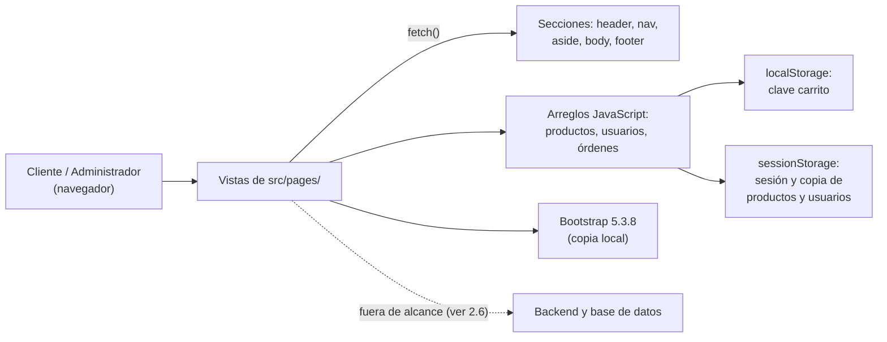
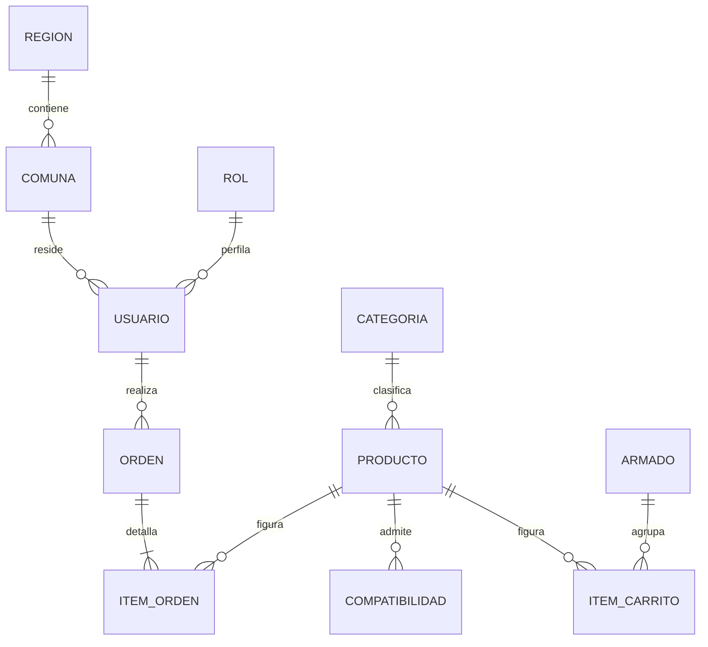

----------------------------------------------------------------------- DUOC UC
- Escuela de Informática y Telecomunicaciones
-----------------------------------------------------------------------
Especificación de Requisitos de Software

*Proyecto:* Ensambla.me – Tienda Online de Tecnología

**Revisión: 2.2**

**Autor:** Daniel Muñoz

**01-10-2026**
-----------------------------------------------------------------------

-----------------------------------------------------------------------
Especificación de Requisitos según estándar de IEEE 830.
-----------------------------------------------------------------------

# Contenido

- [Ficha del documento](#ficha-del-documento)
- [1. Introducción](#1-introducción)
  - [1.1. Propósito](#11-propósito)
  - [1.2. Ámbito del Sistema](#12-ámbito-del-sistema)
  - [1.3. Definiciones, Acrónimos y Abreviaturas](#13-definiciones-acrónimos-y-abreviaturas)
  - [1.4. Referencias](#14-referencias)
  - [1.5. Visión General del Documento](#15-visión-general-del-documento)
- [2. Descripción General](#2-descripción-general)
  - [2.1. Perspectiva del Producto](#21-perspectiva-del-producto)
  - [2.2. Funciones del Producto](#22-funciones-del-producto)
  - [2.3. Características de los Usuarios](#23-características-de-los-usuarios)
  - [2.4. Restricciones](#24-restricciones)
  - [2.5. Suposiciones y Dependencias](#25-suposiciones-y-dependencias)
  - [2.6. Requisitos Futuros](#26-requisitos-futuros)
- [3. Requisitos Específicos](#3-requisitos-específicos)
  - [3.1 Requisitos comunes de las interfaces](#31-requisitos-comunes-de-las-interfaces)
    - [3.1.1 Interfaces de usuario](#311-interfaces-de-usuario)
    - [3.1.2 Interfaces de hardware](#312-interfaces-de-hardware)
    - [3.1.3 Interfaces de software](#313-interfaces-de-software)
    - [3.1.4 Interfaces de comunicación](#314-interfaces-de-comunicación)
  - [3.2 Requisitos funcionales](#32-requisitos-funcionales)
  - [3.3 Requisitos no funcionales](#33-requisitos-no-funcionales)
    - [3.3.1 Requisitos de rendimiento](#331-requisitos-de-rendimiento)
    - [3.3.2 Seguridad](#332-seguridad)
    - [3.3.3 Fiabilidad](#333-fiabilidad)
    - [3.3.4 Disponibilidad](#334-disponibilidad)
    - [3.3.5 Mantenibilidad](#335-mantenibilidad)
    - [3.3.6 Portabilidad](#336-portabilidad)
  - [3.4 Otros Requisitos](#34-otros-requisitos)
- [Anexo A. Trazabilidad de requisitos](#anexo-a-trazabilidad-de-requisitos)

# Ficha del documento

| **Fecha**  | **Revisión** | **Autor**    | **Modificación**                                                       |
|------------|--------------|--------------|------------------------------------------------------------------------|
| 24-09-2026 | 1.0          | Daniel Muñoz | Versión inicial del ERS (Entrega I)                                    |
| 29-09-2026 | 1.1          | Daniel Muñoz | Corrección de inconsistencias y requisitos faltantes                   |
| 29-09-2026 | 1.2          | Daniel Muñoz | Historias de usuario, criterios de aceptación y trazabilidad           |
| 29-09-2026 | 1.3          | Daniel Muñoz | Historias de usuario y criterios de aceptación en sección propia       |
| 29-09-2026 | 1.4          | Daniel Muñoz | Conformidad con Anexos 1 y 4 y con la pauta de Evaluación Parcial N° 1 |
| 29-09-2026 | 1.5          | Daniel Muñoz | Reducción de redundancia y compactación del documento                  |
| 29-09-2026 | 1.6          | Daniel Muñoz | Sugerencias de validación, HTML válido, barra lateral y herramientas   |
| 29-09-2026 | 1.7          | Daniel Muñoz | Modelo de datos lógico, diagramas y trazabilidad hacia delante         |
| 29-09-2026 | 1.8          | Daniel Muñoz | Modelo de datos lógico normalizado hasta 3NF                           |
| 30-09-2026 | 2.0          | Daniel Muñoz | Reestructuración del documento a la plantilla del Anexo 4              |
| 30-09-2026 | 2.1          | Daniel Muñoz | Reclasificación de requisitos funcionales y poda de criterios          |
| 01-10-2026 | 2.2          | Daniel Muñoz | Corrección del ejemplo de RUN, sessionStorage y trazabilidad vigente   |

Documento validado por las partes en fecha: *pendiente de presentación (Entrega
I)*.

| Por el cliente               | Por la empresa suministradora |
|------------------------------|-------------------------------|
| [Firma]                      | [Firma]                       |
| Sr./Sra. — Docente evaluador | Sr./Sra. Daniel Muñoz         |

# 1. Introducción

Esta sección introduce el documento de Especificación de Requisitos de Software
(ERS) para **Ensambla.me**, tienda online de artículos tecnológicos.

## 1.1. Propósito

Este documento describe los requisitos funcionales y no funcionales del sitio
web **Ensambla.me**, una tienda online de productos tecnológicos que además
ofrece un asistente de armado guiado de PC gamer por componentes, en su primera
versión (Entrega I de la Evaluación Parcial N° 1 de la asignatura Desarrollo
Fullstack II, DSY1104). Está dirigido al docente evaluador y sirve además como
referencia interna para el desarrollador durante la construcción del sitio y en
evaluaciones futuras del mismo proyecto. El proyecto se desarrolla de forma
individual por un único estudiante, modalidad autorizada por el docente de la
asignatura.

## 1.2. Ámbito del Sistema

El sistema se denomina **Ensambla.me** y consiste en un sitio web que guía al
cliente en la construcción de su PC gamer, permitiéndole escoger paso a paso los
componentes hasta completar el equipo entero o bien solo módulos específicos. En
esta primera entrega, el sistema:

- **Sí hará:** ofrecer una tienda pública con catálogo de productos y su
  detalle, blogs, información de la empresa y contacto; el registro, inicio y
  cierre de sesión de usuarios; el asistente de armado, completo o por módulos;
  y un carrito de compras gestionable. Sobre esa tienda, un panel administrativo
  protegido con mantenedores de Productos y Usuarios y la consulta en solo
  lectura de órdenes simuladas (detalle en 2.2).
- **No hará (en esta entrega):** procesar pagos reales, conectarse a una base de
  datos o backend real, ni gestionar el ciclo completo de una orden de compra
  (despacho, facturación). Tampoco validará la compatibilidad técnica real entre
  componentes: el asistente filtra cada categoría según la tabla de
  compatibilidad estática (ver 1.3) y el motor de validación real queda como
  requisito futuro (ver 2.6). Las restricciones técnicas se detallan en 2.4.

El beneficio esperado es contar con una base funcional y bien estructurada (HTML
semántico, CSS propio y responsivo, validaciones JS) que sirva de fundamento
para incorporar en evaluaciones posteriores un backend real, base de datos y
pasarela de pago.

## 1.3. Definiciones, Acrónimos y Abreviaturas

- **Criterio de aceptación**: condición verificable de un requisito; si describe
  un flujo, en formato Dado / Cuando / Entonces.
- **Prioridad**: importancia de un requisito en el Anexo A: *Esencial*,
  *Condicional* u *Opcional*, según qué fuente lo exija.
- **RUN**: Rol Único Nacional, identificador de personas en Chile; se ingresa
  sin puntos ni guion (ej. `190110222`) y se valida su dígito verificador.
- **Dominios permitidos**: únicos dominios de correo aceptados por cualquier
  campo de correo del sistema: `@duoc.cl`, `@profesor.duoc.cl` y `@gmail.com`.
- **Código de producto (SKU)**: identificador de texto único de cada producto
  del catálogo.
- **Armado (build)**: conjunto de componentes seleccionados con el asistente de
  armado para configurar una PC gamer, completa o por módulos.
- **Módulo**: subconjunto de categorías de componentes (ej. solo almacenamiento)
  que el cliente puede armar sin construir el equipo completo.
- **Componente**: cada pieza de hardware seleccionable dentro de un armado,
  según las categorías que enumera RF-07.
- **Tabla de compatibilidad**: estructura estática en los arreglos JS que asocia
  cada componente con los admisibles de la siguiente categoría.
- **Stock crítico**: cantidad mínima de unidades de un producto a partir de la
  cual el sistema muestra una alerta de bajo inventario.
- **CRUD**: Crear, Leer (listar), Actualizar y Eliminar.
- **Mantenedor**: vista administrativa que implementa las operaciones CRUD de
  una entidad (Producto o Usuario), salvo Eliminar (ver 2.6).

## 1.4. Referencias

- Anexo 1 — Instrucciones para el desarrollo de la Evaluación 1 (30%),
  incluyendo mockups de cada vista.
- Anexo 2 — Planilla de Requerimientos (guía de columnas para el seguimiento de
  requisitos).
- Anexo 3 — Ejemplo de Planilla de Requerimientos.
- Anexo 4 — Plantilla ERS - Especificación de Requisitos del Software (IEEE
  830), base y estructura de este documento.
- Pauta de la Evaluación Parcial N° 1 — «Construyendo las bases para mi
  aplicación web»: situaciones evaluativas, indicadores de evaluación (IE) y
  ponderaciones de la asignatura Desarrollo Fullstack II (DSY1104).

## 1.5. Visión General del Documento

Este documento consta de un área de definición del negocio (sección 2,
Descripción General) y un área de especificación de requisitos (sección 3,
Requisitos Específicos), donde cada requisito funcional se detalla mediante una
ficha con sus criterios de aceptación, se enuncian los requisitos no funcionales
con los suyos y se especifica el modelo lógico de la información almacenada. El
Anexo A cierra con la tabla de trazabilidad que relaciona cada requisito con su
origen, su clasificación y los archivos que lo realizan. Los requisitos se
identifican con códigos estables RF-xx y RNF-xx, conforme a la exigencia de que
todo requisito sea unívocamente identificable mediante un código adecuado.

La pauta de la Evaluación Parcial N° 1 exige que el ERS cubra tres bloques de
contenido: los requerimientos (sección 3 y Anexo A), las herramientas (2.1, 2.4
y 3.1.3) y las propuestas del proyecto (1.2, 2.2 y 2.6).

# 2. Descripción General

Esta sección describe los factores que afectan al producto **Ensambla.me** y a
sus requisitos; los requisitos en sí se especifican en la sección 3.

## 2.1. Perspectiva del Producto

Ensambla.me es un producto independiente: un sitio web frontend (HTML, CSS y
JavaScript puro, apoyado en el framework Bootstrap para estilos y componentes)
que no depende de ni se integra con otros sistemas externos en esta entrega. No
existe backend ni base de datos; toda la información de productos, usuarios,
órdenes y carrito se maneja del lado del cliente: arreglos JavaScript y Web
Storage, donde `localStorage` conserva el carrito y `sessionStorage` la sesión
iniciada y la copia de trabajo de productos y usuarios (ver 3.1.3).

Además del catálogo tradicional, Ensambla.me se diferencia por incorporar un
asistente de armado por componentes que guía al cliente, categoría por
categoría, en la construcción de una PC gamer completa o por módulos.

Cada página se compone de archivos HTML separados por sección, que el navegador
resuelve mediante `fetch()`, lo que obliga a servir el proyecto por HTTP (ver
3.1.3 y 3.1.4). El siguiente diagrama de bloques resume el producto y su
entorno:



## 2.2. Funciones del Producto

Las funciones del sistema se agrupan en dos áreas, cuyas relaciones muestra el
siguiente diagrama de componentes:


**Tienda (pública):**

- Navegación mediante menú superior con logo y acceso al carrito, barra lateral
  con las categorías del catálogo en las vistas de tienda y pie de página
  informativo (RF-14).
- Catálogo de productos con imagen, nombre y precio, y detalle de cada producto
  (RF-03, RF-04).
- Asistente de armado de PC gamer (*Ensambla.me*): selección guiada de
  componentes categoría por categoría, filtrada por la tabla de compatibilidad,
  completa o por módulos (RF-07).
- Carrito de compras: agregar, eliminar, modificar cantidades, ver el total y
  persistir su contenido en `localStorage` (RF-05, RF-06).
- Registro de nuevos usuarios, inicio de sesión y cierre de sesión (RF-01,
  RF-02, RF-13).
- Página "Nosotros", sección de blogs con listado y detalle, y formulario de
  contacto (RF-15, RF-09, RF-08).

**Administración (protegida):**

- Control de acceso según rol y home administrativo con menú vertical (RF-02,
  RNF-08).
- Mantenedores de Productos y de Usuarios: listar, crear y editar (RF-10,
  RF-11).
- Vista de solo lectura de productos y órdenes para el rol Administrador
  logístico (RF-12).

## 2.3. Características de los Usuarios

El sistema contempla tres tipos de perfiles de usuario:

- **Administrador**: acceso total al sistema, incluidos los mantenedores de
  Producto y Usuario. Se espera manejo de PC a nivel de usuario, sin
  conocimientos técnicos avanzados.
- **Administrador logístico** (denominado *Vendedor* en el Anexo 1; se renombra
  para reflejar con mayor precisión su función): solo visualiza el listado y
  detalle de productos y de órdenes, sin acceso a ninguna otra funcionalidad
  administrativa. Se espera manejo de PC básico.
- **Cliente**: usuario de la tienda pública; puede registrarse, iniciar sesión,
  navegar el catálogo, comprar y contactar a la empresa. No requiere
  conocimiento técnico particular, solo el uso habitual de un navegador.

## 2.4. Restricciones

- El sistema debe construirse únicamente con HTML, CSS y JavaScript puro, más el
  framework Bootstrap, sin frameworks adicionales de JavaScript.
- No debe utilizarse backend ni base de datos real; los datos se simulan en
  arreglos JavaScript, `localStorage` y `sessionStorage`.
- El diseño debe ser responsivo y consistente en todas las páginas mediante una
  hoja de estilos CSS externa y propia.
- El proyecto debe versionarse con Git y publicarse en un repositorio público de
  GitHub, con commits claros y descriptivos.
- Las vistas administrativas deben protegerse mediante autenticación, aunque sea
  simulada del lado del cliente en esta entrega.
- El sitio debe ejecutarse detrás de un servidor HTTP y no abrirse como archivo
  local (ver 3.1.4).

## 2.5. Suposiciones y Dependencias

- Se asume que el usuario accede desde un navegador web moderno con soporte de
  Web Storage (`localStorage` y `sessionStorage`), Fetch API y JavaScript
  habilitado.
- Se asume que los datos de prueba de productos, usuarios y órdenes (arreglos
  JS) son representativos para la demostración, y que no se requiere
  persistencia real entre distintos dispositivos o usuarios: los productos y
  usuarios creados en el registro o en los mantenedores se pierden al cerrar el
  navegador.
- Si en evaluaciones futuras se incorpora un backend y base de datos real,
  varios requisitos actuales —especialmente los de persistencia de carrito,
  productos y usuarios— deberán revisarse y actualizarse.

## 2.6. Requisitos Futuros

- Incorporación de un backend real con base de datos para persistir productos,
  usuarios y órdenes, conforme al modelo lógico especificado en 3.2.
- Integración de una pasarela de pago para completar el flujo de compra.
- Gestión completa de órdenes: estado del pedido e historial de compras del
  cliente.
- Operación Eliminar en los mantenedores de Producto y Usuario, completando el
  CRUD definido en 1.3; el Anexo 1 la menciona al describir el sistema de
  gestión, pero no la exige en los mockups de mantenedor, que solo definen el
  listado y la creación.
- Panel de reportes y estadísticas para el rol Administrador.
- Recuperación de contraseña y verificación de correo electrónico en el
  registro.
- Motor de validación automática de la compatibilidad técnica real entre
  componentes (socket de CPU, tipo de memoria RAM, formato de gabinete, potencia
  de la fuente), en reemplazo de la tabla de compatibilidad estática de esta
  entrega.

# 3. Requisitos Específicos

Esta sección especifica los requisitos de Ensambla.me con el detalle suficiente
para diseñar el sistema y para verificar, una vez construido, si los satisface.
Todo requisito lleva un código unívoco y estable (RF-xx, RNF-xx), una lista de
criterios de aceptación verificables, y una clasificación, una prioridad y un
origen registrados en el Anexo A.

## 3.1 Requisitos comunes de las interfaces

### 3.1.1 Interfaces de usuario

Las interfaces de usuario serán páginas web. Las vistas públicas son inicio,
productos, detalle de producto, blogs, detalle de blog, nosotros, contacto,
carrito, registro e inicio de sesión; las vistas administrativas son el home del
panel, los mantenedores de Productos y de Usuarios, y el listado y detalle de
órdenes.

Toda vista pública presenta un menú superior de navegación con el logo de la
tienda, los enlaces a Inicio, Productos, Blogs, Nosotros y Contacto y un acceso
al carrito de compras que muestra la cantidad de ítems; un área de contenido
central para la funcionalidad de cada vista; y un pie de página informativo con
el nombre de la tienda, los enlaces de navegación principales, los datos de
contacto de la empresa y el año. Las vistas de tienda presentan además una barra
lateral con accesos a las categorías del catálogo. La página de inicio presenta,
por sobre el listado de productos, un componente principal con la información y
la imagen de la tienda. La vista "Nosotros" presenta la información
institucional de la empresa y de sus desarrolladores (RF-15).

El panel de administración utiliza un menú lateral vertical visible con los
accesos a los mantenedores. El asistente de armado se presenta como un flujo
guiado paso a paso, una categoría de componente a la vez, dentro del área de
contenido. El diseño es responsivo y consistente en todas las páginas gracias a
una hoja de estilos CSS externa y a los componentes de Bootstrap.

Criterios de aceptación (RNF-08):

1. Toda vista pública muestra el menú superior con el logo de la tienda y los
   enlaces a Inicio, Productos, Blogs, Nosotros y Contacto, más el acceso al
   carrito de compras.
2. La página de inicio presenta un componente principal con la información y la
   imagen de la tienda, visible antes del listado de productos.
3. Toda vista de tienda muestra la barra lateral con los accesos a las
   categorías del catálogo.
4. Toda vista pública muestra un pie de página con el nombre de la tienda, los
   enlaces de navegación principales, los datos de contacto y el año.
5. El home administrativo presenta un menú vertical visible cuyas opciones abren
   los mantenedores de Productos y Usuarios (RF-10 y RF-11).
6. La vista "Nosotros" es accesible desde el menú superior de cualquier vista
   pública.

### 3.1.2 Interfaces de hardware

El sistema debe poder visualizarse y utilizarse correctamente desde un
dispositivo táctil móvil (smartphone o tablet), además de computadores de
escritorio, gracias al diseño responsivo.

### 3.1.3 Interfaces de software

- **Bootstrap 5.3.8 (CSS y JS)**: framework para estilos, componentes de
  interfaz (menús, formularios, botones) y comportamiento responsivo. Se declara
  como dependencia npm en `package.json` y se distribuye como copia local en
  `src/bootstrap/`, de modo que el sitio no dependa de una CDN.
- **Fetch API**: utilizada por `src/scripts/includes.js` para solicitar,
  mediante peticiones HTTP GET del mismo origen, los archivos HTML de cada
  sección (encabezado, navegación, aside, cuerpo, pie de página) y componer así
  cada página del sitio.
- **Web Storage API (`localStorage` y `sessionStorage`)**: `localStorage`
  persiste el contenido del carrito en el navegador del cliente, bajo una única
  clave `carrito` cuyo valor es un arreglo serializado en JSON con una entrada
  por línea, cada una con su producto, su cantidad y, si pertenece a un armado,
  el agrupador de ese armado (ver el modelo lógico al final de 3.2).
  `sessionStorage` dura lo que la sesión del navegador y guarda tres claves:
  `sesion`, con el RUN, nombre, apellidos, correo y rol del usuario autenticado,
  que se elimina al cerrar sesión (RF-13); y `productos` y `usuarios`, copias de
  trabajo sembradas desde los arreglos JavaScript, para que los registros
  creados o editados en RF-01, RF-10 y RF-11 puedan usarse en la misma sesión
  del navegador (por ejemplo, para iniciar sesión con un usuario recién
  registrado).

### 3.1.4 Interfaces de comunicación

El sistema no consume APIs externas ni servicios de terceros: toda la lógica de
negocio se ejecuta en el navegador. Sin embargo, no puede abrirse como archivo
local: realiza peticiones **HTTP GET del mismo origen** para cargar sus propios
fragmentos HTML mediante `fetch()`, por lo que debe publicarse o ejecutarse
detrás de un servidor HTTP. Para desarrollo local basta, por ejemplo, con:

```
python3 -m http.server 8000
```

y abrir `http://localhost:8000/src/pages/index.html`. Abierto con el esquema
`file://`, el navegador bloquea esas peticiones y las secciones de la página no
se cargan.

## 3.2 Requisitos funcionales

Cada requisito funcional se especifica mediante una ficha con su código y
nombre, los actores involucrados, la descripción del comportamiento esperado y
sus criterios de aceptación, que son las condiciones verificables que deben
cumplirse para darlo por satisfecho y la base con que se completa la columna
"Criterio de Aceptación" de la Planilla de Requerimientos (Anexos 2 y 3). Las
descripciones enuncian qué hace el sistema con independencia de la interfaz, de
la tecnología y de la estructura del proyecto, que se especifican en 3.1, 2.4 y
3.3; los criterios sí nombran mecanismos concretos, porque son pruebas. Los
códigos RF-xx son identificadores estables: no se reutilizan ni se renumeran al
agregar nuevos requisitos; el código RF-16 se retira en esta revisión, por
describir únicamente aspectos ya especificados en RF-02, 3.1.1 y 3.3.2, y no
volverá a usarse. La subsección cierra con los requisitos lógicos de la
información que el sistema almacena.

> **RF-01 — Registrar usuario**
>
> Actores: Cliente
>
> Descripción: El cliente debe poder registrarse en el sistema completando un
> formulario con RUN (requerido, sin puntos ni guion, mín. 7, máx. 9, validando
> el dígito verificador), nombre (requerido, máx. 50), apellidos (requerido,
> máx. 100), correo (requerido, máx. 100, restringido a los dominios permitidos
> definidos en 1.3), contraseña (requerida, entre 4 y 10 caracteres, misma regla
> que el inicio de sesión de RF-02; su presentación enmascarada se especifica en
> 3.3.2), fecha de nacimiento (opcional), región y comuna (requeridas, y las
> comunas ofrecidas deben corresponder a la región escogida) y dirección
> (requerida, máx. 300). Estas son las mismas reglas usadas por el mantenedor
> "Crear usuario" del administrador (RF-11).
>
> Nota: el Anexo 1 no incluye el campo contraseña en su lista de campos de
> usuario, aunque sí lo exige en el inicio de sesión; se define como requerido
> en el registro por decisión del proyecto, dado que sin él no es posible
> autenticar al usuario.
>
> Criterios de aceptación:
>
> 1. Cuando se envía con un campo requerido vacío (RUN, nombre, apellidos,
>    correo, contraseña, región, comuna o dirección), el sistema impide el envío
>    y marca cada campo faltante con su mensaje de error.
> 2. El RUN se acepta sin puntos ni guion, con entre 7 y 9 caracteres y dígito
>    verificador correcto (`190110222`); uno con puntos, guion o dígito
>    incorrecto (`19.011.022-3`) se rechaza con el error "RUN inválido" y el
>    formulario no se envía.
> 3. Un correo cuyo dominio no está entre los permitidos (`juan@hotmail.com`) se
>    rechaza con un error que indica los dominios aceptados.
> 4. Una contraseña de menos de 4 o más de 10 caracteres se rechaza con su
>    error.
> 5. Cuando se cambia la región seleccionada, el select de comuna se recarga
>    únicamente con las comunas de esa región.
> 6. Los valores que superan los máximos definidos (nombre > 50, apellidos >
>    100, correo > 100, dirección > 300 caracteres) no pueden ingresarse o
>    muestran el error correspondiente.
> 7. Cuando se envía un formulario completo y válido, el usuario se agrega al
>    arreglo de usuarios y se muestra un mensaje de confirmación.
> 8. El campo de correo ofrece los dominios permitidos como sugerencia
>    seleccionable (`datalist`), de modo que puedan completarse sin escribirlos.

> **RF-02 — Iniciar sesión**
>
> Actores: Cliente, Administrador logístico, Administrador
>
> Descripción: El usuario debe poder iniciar sesión con correo (requerido, máx.
> 100, restringido a los dominios permitidos definidos en 1.3) y contraseña
> (requerida, entre 4 y 10 caracteres). Según el tipo de usuario autenticado, el
> sistema debe redirigir y habilitar las funcionalidades correspondientes a su
> rol.
>
> Criterios de aceptación:
>
> 1. Cuando el correo y la contraseña coinciden con un usuario registrado, la
>    sesión se inicia y se habilitan las funcionalidades de su rol: el rol
>    Cliente llega a la tienda pública; el rol Administrador, al panel de
>    gestión con sus mantenedores (RF-10 y RF-11); el rol Administrador
>    logístico, a productos y órdenes en solo lectura (RF-12).
> 2. Un correo de dominio no permitido o una contraseña de menos de 4 o más de
>    10 caracteres se rechazan con su error y el formulario no se envía.
> 3. Unas credenciales que no coinciden con ningún usuario producen un mensaje
>    genérico ("correo o contraseña incorrectos"), sin revelar cuál de los dos
>    falló.

> **RF-03 — Visualizar catálogo de productos**
>
> Actores: Cliente
>
> Descripción: El cliente debe poder consultar el catálogo de productos y ver de
> cada uno su imagen, su nombre y su precio. El listado debe obtenerse de los
> datos de productos y no del marcado de la vista, de modo que agregar un
> producto a los datos baste para que aparezca. Las vistas que presentan el
> catálogo y la disposición de sus elementos se especifican en 3.1.1.
>
> Criterios de aceptación:
>
> 1. Al cargar una vista de catálogo se renderiza una tarjeta por cada producto
>    con su imagen, nombre y precio; al agregar un elemento a los datos y
>    recargar la página, la nueva tarjeta aparece sin haber modificado el HTML,
>    lo que demuestra que el listado se genera dinámicamente.
> 2. Los precios se muestran formateados como moneda (pesos chilenos).
> 3. Con el arreglo de productos vacío, la vista muestra un mensaje de "no hay
>    productos disponibles" en lugar de un área en blanco.

> **RF-04 — Ver detalle de producto**
>
> Actores: Cliente
>
> Descripción: El cliente debe poder obtener el detalle de un producto
> determinado a partir del listado, con sus datos y con la posibilidad de
> añadirlo al carrito de compras. El detalle debe incluir el video que el
> producto defina en su campo opcional `video` (ver RF-10), y presentarse
> completo cuando no lo define.
>
> Criterios de aceptación:
>
> 1. Al hacer clic sobre un producto del listado se navega al detalle de ese
>    producto y no de otro.
> 2. El detalle muestra imagen, nombre, precio, descripción y categoría del
>    producto seleccionado, e incluye un botón "Añadir al carrito" operativo
>    (RF-05).
> 3. Un código de producto que no existe en el arreglo produce un mensaje de
>    producto no encontrado, en lugar de una vista vacía o un error de
>    JavaScript.
> 4. Dado un producto que define el campo `video`, su detalle lo muestra
>    embebido y reproducible sin salir del sitio; si no lo define, la vista se
>    muestra completa y sin contenedores vacíos.

> **RF-05 — Agregar producto al carrito**
>
> Actores: Cliente
>
> Descripción: El cliente debe poder agregar un producto al carrito de compras
> desde la vista de listado de productos o desde el detalle de producto.
>
> Criterios de aceptación:
>
> 1. Al pulsar el botón de añadir, tanto desde el listado como desde el detalle,
>    el producto se agrega al carrito, el contador de ítems aumenta en uno y el
>    contenido del carrito se guarda de inmediato en `localStorage`.
> 2. Un producto que ya está en el carrito incrementa su cantidad en lugar de
>    crear una segunda línea para el mismo producto.
> 3. Cada vez que se añade un producto se muestra una confirmación visual al
>    cliente.

> **RF-06 — Gestionar carrito de compras**
>
> Actores: Cliente
>
> Descripción: El cliente debe poder visualizar el contenido del carrito de
> compras, eliminar un producto del carrito, modificar la cantidad de un ítem y
> ver el total calculado a partir de los precios y las cantidades. El contenido
> del carrito debe conservarse entre sesiones del navegador (ver 3.1.3).
>
> Criterios de aceptación:
>
> 1. Cada línea del carrito muestra imagen, nombre, precio unitario, cantidad y
>    subtotal.
> 2. Al eliminar un ítem, este desaparece del listado y el total se recalcula
>    sin recargar la página.
> 3. Al modificar la cantidad de un ítem se recalculan su subtotal y el total,
>    que corresponde exactamente a la suma de precio unitario por cantidad de
>    todas las líneas; no se permite una cantidad menor que 1.
> 4. Dado un carrito con productos, al recargar la página o cerrar y reabrir el
>    navegador el carrito conserva su contenido (persistencia en
>    `localStorage`).
> 5. Con el carrito vacío se muestra un mensaje indicándolo y el total es 0.

> **RF-07 — Armar PC gamer por componentes**
>
> Actores: Cliente
>
> Descripción: El cliente debe poder utilizar el asistente de armado
> (*Ensambla.me*) para construir una PC gamer seleccionando, categoría por
> categoría (CPU, placa madre, RAM, almacenamiento, fuente de poder, gabinete,
> refrigeración, tarjeta gráfica, periféricos), los componentes deseados. Al
> seleccionar un componente, el sistema debe filtrar las opciones de la
> siguiente categoría según la tabla de compatibilidad estática (ver 1.3); no se
> realiza ningún cálculo de compatibilidad técnica real, lo que queda como
> requisito futuro (ver 2.6). El cliente puede optar por completar el armado de
> todas las categorías (equipo completo) o seleccionar solo algunos módulos de
> forma independiente (ej. solo almacenamiento). Al finalizar, el cliente puede
> agregar el conjunto de componentes armado al carrito de compras.
>
> Criterios de aceptación:
>
> 1. El asistente presenta las categorías en un orden definido y una categoría a
>    la vez.
> 2. Seleccionado un componente, la siguiente categoría lista solo las opciones
>    asociadas a él en la tabla de compatibilidad; por ejemplo, escogido un CPU
>    de un socket determinado, la categoría de placa madre no ofrece placas
>    asociadas a otro socket.
> 3. En modo módulos, finalizar sin recorrer todas las categorías está permitido
>    y agrega al carrito únicamente los componentes seleccionados.
> 4. Recorridas todas las categorías (equipo completo), al finalizar se agrega
>    al carrito el conjunto completo.
> 5. Un armado agregado al carrito se identifica como un conjunto, muestra el
>    detalle de sus componentes y su precio corresponde a la suma de ellos.
> 6. El sistema no emite ningún juicio de compatibilidad técnica real: si la
>    tabla asocia dos componentes, la combinación se acepta (ver 1.2 y 2.6).

> **RF-08 — Enviar mensaje de contacto**
>
> Actores: Cliente
>
> Descripción: El cliente debe poder enviar un mensaje interno a la empresa
> mediante un formulario de contacto con nombre (requerido, máx. 100), correo
> (requerido, máx. 100, restringido a los dominios permitidos definidos en 1.3)
> y comentario (requerido, máx. 500).
>
> Nota: el Anexo 1 no marca el correo como obligatorio en este formulario; se
> exige como requerido por decisión del proyecto, dado que sin él la empresa no
> puede responder el mensaje.
>
> Criterios de aceptación:
>
> 1. Cuando se envía con el nombre, el correo o el comentario vacíos, se impide
>    el envío y se muestra el error en cada campo faltante.
> 2. Un correo de dominio no permitido se rechaza con un error que indica los
>    dominios aceptados.
> 3. Un nombre de más de 100 caracteres o un comentario de más de 500 no pueden
>    ingresarse o muestran el error correspondiente.
> 4. Cuando se envía un formulario válido, se muestra un mensaje de éxito y los
>    campos quedan limpios.

> **RF-09 — Consultar blogs**
>
> Actores: Cliente
>
> Descripción: El cliente debe poder visualizar un listado de artículos de blog
> (imagen, título, descripción corta) y acceder al detalle de al menos dos
> artículos (imagen, título, descripción larga).
>
> Criterios de aceptación:
>
> 1. La vista de blogs muestra un listado de artículos, cada uno con imagen,
>    título y descripción corta.
> 2. Al hacer clic en un artículo se abre su detalle con imagen, título y
>    descripción larga, y existen al menos dos artículos con detalle navegable.

> **RF-10 — Mantenedor de Productos**
>
> Actores: Administrador
>
> Descripción: El administrador debe poder listar todos los productos, crear un
> nuevo producto y editar uno existente, ingresando: código de producto (SKU)
> (requerido, texto, mín. 3 caracteres, sin límite superior), nombre (requerido,
> máx. 100), descripción (opcional, máx. 500), precio (requerido, mín. 0 —un
> valor 0 se considera un producto gratuito—, sin límite superior, admite
> decimales), stock (requerido, mín. 0, sin límite superior, solo enteros),
> stock crítico (opcional, mín. 0, solo enteros, muestra alerta cuando el stock
> sea igual o inferior a este valor), categoría (requerida, escogida entre las
> categorías del catálogo), imagen (opcional) y video (opcional, URL del video
> que se muestra en el detalle del producto, ver RF-04).
>
> Nota: el campo video no figura en la lista de campos de producto del Anexo 1;
> se agrega por decisión del proyecto para dar soporte mantenible al video
> embebido que exige el indicador IE1.1.1 de la pauta de evaluación.
>
> Criterios de aceptación:
>
> 1. La vista de listado muestra todos los productos con las acciones de crear y
>    editar disponibles: al crear un producto con un formulario válido este
>    aparece en el listado, y al editar uno existente los cambios se reflejan en
>    él.
> 2. Se rechazan con su error un código de menos de 3 caracteres, un precio
>    negativo y un stock negativo o con decimales; el precio admite decimales y
>    un precio 0 se acepta como producto gratuito.
> 3. Una categoría sin seleccionar impide el envío del formulario, por ser un
>    campo requerido.
> 4. Un producto cuyo stock es igual o inferior a su stock crítico muestra una
>    alerta visible de bajo inventario en el listado.
> 5. Cuando se guarda una URL en el campo video, el valor se conserva y el
>    detalle del producto lo muestra embebido; dejarlo vacío no impide guardar.
> 6. La vista no ofrece la acción Eliminar, que queda fuera del alcance de esta
>    entrega (ver 1.3 y 2.6).

> **RF-11 — Mantenedor de Usuarios**
>
> Actores: Administrador
>
> Descripción: El administrador debe poder listar todos los usuarios, crear un
> nuevo usuario y editar uno existente, con las mismas reglas de campos que
> RF-01 (incluidos RUN y contraseña), más un campo adicional de tipo de usuario
> (requerido: Administrador, Cliente o Administrador logístico), que solo puede
> asignarse desde este mantenedor y no en el registro público (RF-01).
>
> Nota: el campo contraseña tampoco figura en la lista de campos de usuario del
> Anexo 1; se mantiene aquí por consistencia con RF-01, ya que este mantenedor
> crea las mismas cuentas con que opera el inicio de sesión.
>
> Criterios de aceptación:
>
> 1. La vista de listado muestra todos los usuarios con las acciones de crear y
>    editar disponibles: al crear un usuario con un formulario válido este
>    aparece en el listado, y al editar uno existente los cambios se reflejan en
>    él.
> 2. El formulario de crear o editar usuario aplica las mismas validaciones de
>    RF-01, incluidas las de RUN y contraseña.
> 3. El select de tipo de usuario ofrece exactamente las opciones Administrador,
>    Cliente y Administrador logístico, y no aparece en el registro público
>    (RF-01).
> 4. Creado un usuario con un rol determinado, al iniciar sesión accede
>    únicamente a lo que su rol permite (RF-02, RF-12).
> 5. La vista no ofrece la acción Eliminar, que queda fuera del alcance de esta
>    entrega (ver 1.3 y 2.6).

> **RF-12 — Visualizar productos y órdenes (rol Administrador logístico)**
>
> Actores: Administrador logístico
>
> Descripción: El administrador logístico debe poder visualizar el listado y
> detalle de productos, y el listado y detalle de órdenes, en modo de solo
> lectura. La restricción de acceso al resto de las funcionalidades
> administrativas se especifica en 3.3.2.
>
> Criterios de aceptación:
>
> 1. El listado de productos se muestra en modo lectura, sin botones de crear,
>    editar ni eliminar.
> 2. Cada orden del listado muestra cliente, fecha, productos y total, y su
>    detalle también se presenta en modo lectura.

> **RF-13 — Cerrar sesión**
>
> Actores: Cliente, Administrador logístico, Administrador
>
> Descripción: El usuario autenticado debe poder cerrar su sesión desde
> cualquier vista. El sistema debe terminar la sesión y revocar el acceso a las
> funcionalidades de su rol, dejando al usuario en la tienda pública (ver
> 3.3.2).
>
> Criterios de aceptación:
>
> 1. La opción de cerrar sesión está visible en todas las vistas a las que el
>    usuario autenticado tiene acceso.
> 2. Cuando el usuario cierra sesión, los datos de sesión almacenados en el
>    cliente se eliminan y se redirige a la tienda pública.
> 3. El contenido del carrito guardado en `localStorage` no se elimina al cerrar
>    sesión, ya que en esta entrega el carrito se asocia al navegador y no al
>    usuario.

> **RF-14 — Navegar el sitio**
>
> Actores: Cliente
>
> Descripción: El cliente debe poder desplazarse entre todas las vistas públicas
> del sitio —inicio, productos, blogs, nosotros y contacto— y conocer en todo
> momento la cantidad de ítems que contiene su carrito de compras. La
> disposición de los elementos de navegación se especifica en 3.1.1 y su
> resolución desde archivos compartidos, en 3.3.5.
>
> Criterios de aceptación:
>
> 1. Cada enlace del menú de navegación conduce a su vista, y el logo de la
>    tienda, a la página de inicio.
> 2. El acceso al carrito muestra la cantidad de ítems que este contiene y se
>    actualiza al agregar o eliminar productos.
> 3. Cada acceso de la barra lateral de categorías navega al listado de
>    productos.

> **RF-15 — Consultar información de la empresa**
>
> Actores: Cliente
>
> Descripción: El sistema debe poner a disposición del cliente información
> institucional de la empresa y la presentación de sus desarrolladores. La vista
> que la presenta y su disposición se especifican en 3.1.1.
>
> Criterios de aceptación:
>
> 1. La información institucional describe de qué se trata la empresa y presenta
>    a sus desarrolladores.

**Requisitos lógicos de la información almacenada**

Estos son los requisitos lógicos de la información que el sistema almacena
—relaciones, atributos, tipo de dato, claves y obligatoriedad—, y anticipan el
modelo de la base de datos que el Anexo 1 proyecta para las entregas siguientes.
El modelo se presenta normalizado hasta la tercera forma normal (3NF) y el
análisis que lo justifica cierra la subsección. Las fichas anteriores siguen
siendo la fuente normativa de las reglas de validación y de los límites de cada
campo: las tablas indican el tipo, la clave y la obligatoriedad, y remiten al
requisito correspondiente en lugar de repetir esos límites. En esta entrega
ninguna relación reside en una base de datos, sino en arreglos JavaScript;
Producto y Usuario se leen y escriben a través de su copia de trabajo en
`sessionStorage`, y el carrito se serializa además en la clave `carrito` de
`localStorage` (ver 3.1.3).



**Catálogo**

| Relación                       | Campo                    | Tipo        | Clave  | Req. | Notas                                                                              |
|--------------------------------|--------------------------|-------------|--------|------|------------------------------------------------------------------------------------|
| Categoría (RF-07, RF-10)       | código                   | Texto       | PK     | Sí   | Identificador de la categoría                                                      |
|                                | nombre                   | Texto       | —      | Sí   | Etiqueta del select de RF-10                                                       |
|                                | orden                    | Entero ≥ 1  | —      | No   | Posición en el recorrido del asistente (RF-07); vacío si no participa en el armado |
| Producto (RF-03, RF-04, RF-10) | código de producto (SKU) | Texto       | PK     | Sí   | Reglas del campo en RF-10                                                          |
|                                | nombre                   | Texto       | —      | Sí   | —                                                                                  |
|                                | descripción              | Texto       | —      | No   | Se muestra en el detalle (RF-04)                                                   |
|                                | precio                   | Decimal ≥ 0 | —      | Sí   | Un valor 0 es un producto gratuito                                                 |
|                                | stock                    | Entero ≥ 0  | —      | Sí   | Unidades en inventario                                                             |
|                                | stock crítico            | Entero ≥ 0  | —      | No   | Umbral de la alerta de bajo inventario                                             |
|                                | categoría                | Texto       | FK     | Sí   | Referencia a Categoría; se escoge mediante select                                  |
|                                | imagen                   | URL         | —      | No   | —                                                                                  |
|                                | video                    | URL         | —      | No   | Video embebido del detalle (RF-04)                                                 |
| Compatibilidad (RF-07)         | producto                 | Texto       | PK, FK | Sí   | Referencia a Producto: el componente escogido                                      |
|                                | producto admisible       | Texto       | PK, FK | Sí   | Referencia a Producto: opción admisible de la categoría siguiente                  |

**Usuarios**

| Relación                      | Campo               | Tipo  | Clave | Req. | Notas                                                                         |
|-------------------------------|---------------------|-------|-------|------|-------------------------------------------------------------------------------|
| Región (RF-01)                | código              | Texto | PK    | Sí   | Proviene del arreglo JS del Anexo 1                                           |
|                               | nombre              | Texto | —     | Sí   | —                                                                             |
| Comuna (RF-01)                | código              | Texto | PK    | Sí   | Proviene del arreglo JS del Anexo 1                                           |
|                               | nombre              | Texto | —     | Sí   | —                                                                             |
|                               | región              | Texto | FK    | Sí   | Referencia a Región; la comuna determina su región                            |
| Rol (RF-02, RF-11, RF-12)     | código              | Texto | PK    | Sí   | La relación contiene exactamente tres filas                                   |
|                               | nombre              | Texto | —     | Sí   | Administrador, Cliente o Administrador logístico                              |
| Usuario (RF-01, RF-02, RF-11) | RUN                 | Texto | PK    | Sí   | Se valida el dígito verificador (RF-01)                                       |
|                               | nombre              | Texto | —     | Sí   | —                                                                             |
|                               | apellidos           | Texto | —     | Sí   | —                                                                             |
|                               | correo              | Texto | —     | Sí   | Dominios permitidos (ver 1.3); credencial de RF-02                            |
|                               | contraseña          | Texto | —     | Sí   | Se presenta enmascarada (ver 3.3.2); credencial de RF-02                      |
|                               | fecha de nacimiento | Fecha | —     | No   | —                                                                             |
|                               | comuna              | Texto | FK    | Sí   | Referencia a Comuna; la región se obtiene de ella (ver Nota)                  |
|                               | dirección           | Texto | —     | Sí   | Dirección de despacho                                                         |
|                               | tipo de usuario     | Texto | FK    | Sí   | Referencia a Rol; determina el acceso (ver 3.3.2) y solo es editable en RF-11 |

**Órdenes**

| Relación              | Campo           | Tipo        | Clave  | Req. | Notas                                                                             |
|-----------------------|-----------------|-------------|--------|------|-----------------------------------------------------------------------------------|
| Orden (RF-12)         | número de orden | Texto       | PK     | Sí   | Ver Nota                                                                          |
|                       | cliente         | Texto       | FK     | Sí   | Referencia a Usuario por su RUN                                                   |
|                       | fecha           | Fecha       | —      | Sí   | Fecha de la compra simulada                                                       |
| Ítem de orden (RF-12) | orden           | Texto       | PK, FK | Sí   | Referencia a Orden                                                                |
|                       | producto        | Texto       | PK, FK | Sí   | Referencia a Producto                                                             |
|                       | cantidad        | Entero ≥ 1  | —      | Sí   | Unidades de ese producto en la orden                                              |
|                       | precio unitario | Decimal ≥ 0 | —      | Sí   | Precio al momento de la compra; no se toma de Producto, que puede cambiar después |

**Carrito y armado**

| Relación                       | Campo         | Tipo       | Clave | Req. | Notas                                                                   |
|--------------------------------|---------------|------------|-------|------|-------------------------------------------------------------------------|
| Armado (RF-07)                 | identificador | Texto      | PK    | Sí   | Agrupa las líneas de carrito que lo componen                            |
| Ítem de carrito (RF-05, RF-06) | n.º de línea  | Entero ≥ 1 | PK    | Sí   | Posición de la línea en el carrito                                      |
|                                | producto      | Texto      | FK    | Sí   | Referencia a Producto                                                   |
|                                | cantidad      | Entero ≥ 1 | —     | Sí   | Cantidad mínima 1 (criterio 3 de RF-06)                                 |
|                                | armado        | Texto      | FK    | No   | Referencia a Armado; las líneas de un mismo armado comparten este valor |

Las órdenes son de solo lectura en esta entrega (RF-12): su creación a partir
del carrito es un requisito futuro (ver 2.6). Ningún componente de un armado
guarda su categoría, porque es derivable del producto al que se refiere.

**Normalización**

- **1NF**: todo atributo es atómico y no hay grupos repetidos: los productos de
  una orden y los componentes de un armado son relaciones propias (Ítem de orden
  e Ítem de carrito) y no listas dentro de Orden ni de Armado.
- **2NF**: las únicas claves compuestas son las de Ítem de orden (orden más
  producto) y Compatibilidad (producto más producto admisible), y en ambas todo
  atributo no clave depende de la clave completa: la cantidad y el precio
  unitario dependen de la línea, no solo de la orden ni solo del producto.
- **3NF**: no quedan dependencias transitivas. La comuna determina su región,
  por lo que la región reside en Comuna y no en Usuario; el orden de recorrido
  depende de la categoría y no del producto, por lo que reside en Categoría; y
  el nombre del rol depende del rol y no del usuario que lo tiene.
- **Valores derivados**: no se almacenan y por eso no figuran como atributos: el
  total de una orden, el subtotal de una línea y el precio de un armado se
  calculan al mostrarlos, de modo que no pueden contradecir las filas que
  resumen.

> Nota: el número de orden no figura en la lista de campos del Anexo 1; se
> agrega por decisión del proyecto, porque RF-12 exige un detalle de orden
> navegable y sin una clave no es posible identificar cuál se abre.

> Nota: el Anexo 1 no declara si región y comuna son requeridas. Ambas se
> declaran requeridas en el formulario de RF-01 por coherencia con la dirección
> de despacho; de las dos solo se almacena la comuna, porque ella determina la
> región. Las regiones y comunas provienen del arreglo JS complementario del
> Anexo 1, que ya tiene esta forma.

> Nota: un armado en curso no se persiste. Existe únicamente como las líneas de
> carrito que comparten su agrupador, cada una referida a un solo producto, y su
> precio es la suma de esas líneas (ver RF-07).

## 3.3 Requisitos no funcionales

Los requisitos no funcionales se identifican con los códigos RNF-01 a RNF-08
para efectos del Anexo A y de la Planilla de Requerimientos; las subsecciones
conservan la numeración de la plantilla y no llevan código en sus títulos.
RNF-08 corresponde a 3.1.1, porque las interfaces son requisitos comunes del
sistema y no funciones suyas. Cada subsección enuncia el requisito y cierra con
sus criterios de aceptación verificables.

### 3.3.1 Requisitos de rendimiento

Al tratarse de un sitio estático sin backend, cada vista debe cargar
completamente en menos de 2 segundos en una conexión de banda ancha estándar,
dado que no existen llamadas a servicios externos ni consultas a base de datos
en esta entrega.

Criterios de aceptación (RNF-01):

1. Servido por HTTP en una conexión de banda ancha estándar, cualquier vista
   termina de cargar en menos de 2 segundos, medido en la pestaña de red del
   navegador con la caché deshabilitada.
2. Al cargar cualquier vista, las únicas peticiones registradas son de recursos
   del mismo origen (HTML de secciones, CSS, JS e imágenes); no se observan
   llamadas a servicios externos.
3. La composición de secciones mediante `fetch()` se completa antes de que el
   usuario pueda interactuar, sin dejar contenedores vacíos de forma permanente.

### 3.3.2 Seguridad

- Todas las contraseñas ingresadas en los formularios deben enmascararse (tipo
  `password`) en pantalla, tanto en el inicio de sesión como en el registro y en
  el mantenedor de Usuarios.
- Las vistas del panel administrativo deben quedar inaccesibles para un usuario
  sin sesión iniciada y para un usuario autenticado con rol Cliente, cuyo acceso
  se limita a la tienda pública.
- Las funcionalidades visibles para el rol Administrador logístico deben
  restringirse a productos y órdenes en modo lectura; el resto de opciones
  administrativas no debe renderizarse para este rol.
- El cierre de sesión (RF-13) debe limpiar los datos de sesión del cliente, de
  modo que las vistas administrativas dejen de ser accesibles.
- Todos los formularios (registro, login, contacto, producto, usuario) deben
  validarse en tiempo real en el cliente, mostrando mensajes de error
  personalizados antes de permitir el envío.
- Además del mensaje de error, cada campo validado debe ofrecer una sugerencia
  que anticipe el formato esperado —por ejemplo el del RUN o los dominios de
  correo aceptados—, visible antes de que el usuario cometa el error.

Criterios de aceptación (RNF-02):

1. Intentar abrir una vista administrativa por URL directa redirige al inicio de
   sesión sin sesión iniciada, y deniega el acceso con rol Cliente o tras haber
   cerrado sesión (RF-13).
2. Dado un usuario autenticado con rol Administrador logístico, el menú
   administrativo solo contiene Productos y Órdenes: las demás opciones no están
   presentes en el DOM, no basta con ocultarlas por CSS.
3. Todo campo de contraseña del sistema (inicio de sesión, registro y mantenedor
   de Usuarios) tiene el atributo `type="password"`, verificable inspeccionando
   el DOM.
4. En cualquier formulario, un valor inválido muestra su mensaje de error antes
   de pulsar el botón de envío.
5. Cada campo con reglas de formato (RUN, correo, contraseña) muestra una
   sugerencia con el formato esperado antes de cualquier intento de envío,
   distinta del mensaje de error que aparece al infringirlo.
6. Dado un usuario autenticado con rol Administrador logístico, abrir por URL
   directa un mantenedor de creación o edición deniega el acceso y no renderiza
   la vista.

### 3.3.3 Fiabilidad

Al no depender de un backend, el sistema no debe presentar errores de carga de
página bajo uso normal del navegador; los únicos incidentes esperables son
errores de validación de formularios, que deben gestionarse y comunicarse
claramente al usuario sin interrumpir la navegación.

Criterios de aceptación (RNF-03):

1. Navegando por todas las vistas del sitio, la consola del navegador no
   registra errores de JavaScript.
2. Un archivo de sección que no se puede cargar deja el error en la consola y el
   resto de la página utilizable, según el manejo de errores implementado en
   `src/scripts/includes.js`.
3. Un error de validación se comunica junto al campo afectado y la navegación
   del sitio sigue disponible.
4. Un contenido inválido o corrupto en `localStorage` hace que el carrito se
   inicialice vacío, en lugar de interrumpir la ejecución.

### 3.3.4 Disponibilidad

Al ser un sitio 100% estático, sin servidor de aplicación ni base de datos, la
disponibilidad depende únicamente del servicio de hosting o repositorio
utilizado para publicarlo. El proyecto no compromete un porcentaje propio de
disponibilidad: el exigible es el que ofrezca el hosting elegido, ya que ningún
componente del sistema puede degradarla.

Criterios de aceptación (RNF-04):

1. Publicado en el servicio de hosting o repositorio elegido, el sitio es
   accesible mediante su URL pública sin requerir credenciales.

### 3.3.5 Mantenibilidad

El sitio debe mantenerse mediante la separación de cada sección de la página
(encabezado, navegación, aside, cuerpo, pie de página) en archivos HTML
independientes referenciados desde `index.html`, y mediante una hoja de estilos
CSS externa única. El mantenimiento —agregar productos de prueba, ajustar
validaciones— lo realiza directamente el desarrollador editando estos archivos,
bajo demanda y sin ventanas programadas, dado que el sitio no almacena datos de
producción que obliguen a detenerlo.

Cada vista debe construirse con etiquetado HTML5 semántico —`<header>`, `<nav>`,
`<main>`, `<section>`, `<article>` y `<footer>`— en lugar de contenedores
`<div>` genéricos, de modo que la estructura del documento sea autodescriptiva y
las secciones compartidas puedan reemplazarse sin ambigüedad. El contenido
textual debe estructurarse con una jerarquía de encabezados, párrafos y listas,
y no con saltos de línea o estilos que los imiten. Cada control de formulario
debe tener su etiqueta `<label>` asociada mediante el atributo `for` y declarar
el atributo `autocomplete` que corresponda al dato solicitado. El comportamiento
de las validaciones se especifica en 3.3.2, y el marcado de cada vista debe
validar sin errores contra el validador del W3C.

Criterios de aceptación (RNF-05):

1. Cada sección de la página (encabezado, navegación, aside, cuerpo y pie)
   reside en su propio archivo dentro de `src/pages/` y se referencia desde
   `index.html` mediante el atributo `data-include`.
2. Existe una única hoja de estilos propia y externa (`src/styles/style.css`), y
   ninguna vista define estilos mediante atributos `style` ni bloques `<style>`.
3. Al modificar una sección compartida (por ejemplo el pie de página), el cambio
   se refleja en todas las vistas habiendo editado un solo archivo.
4. Inspeccionando el marcado de cualquier vista, la estructura se expresa con
   `<header>`, `<nav>`, `<main>`, `<section>`/`<article>` y `<footer>`, y no con
   contenedores `<div>` genéricos en su lugar; cada vista tiene un único `<h1>`
   y su contenido textual se estructura con encabezados, párrafos y listas.
5. Cada control de formulario tiene una etiqueta `<label>` asociada mediante un
   atributo `for` que coincide con el `id` del campo.
6. Los campos de formulario declaran el atributo `autocomplete` con el valor que
   corresponde al dato solicitado.
7. El marcado de cada vista, servido por HTTP, pasa el validador del W3C
   (`validator.w3.org`) sin errores.

### 3.3.6 Portabilidad

El sistema debe funcionar correctamente en cualquier navegador web moderno
(Chrome, Firefox, Edge) sin depender de un sistema operativo, compilador o
plataforma de desarrollo específica, dado que utiliza únicamente HTML, CSS,
JavaScript y Bootstrap. La única condición de ejecución es servirlo mediante un
servidor HTTP (ver 3.1.4).

Criterios de aceptación (RNF-06):

1. Servido por HTTP, el sitio se visualiza y opera correctamente en las
   versiones actuales de Chrome, Firefox y Edge; abierto con el esquema
   `file://` las secciones no se cargan (ver 3.1.4).
2. El proyecto no requiere compilación, instalación de dependencias ni
   configuración específica del sistema operativo para ejecutarse.
3. En cualquier viewport de escritorio, tablet o móvil el diseño se adapta sin
   producir desplazamiento horizontal (ver 3.1.2).

## 3.4 Otros Requisitos

- El proyecto debe mantenerse en un repositorio Git/GitHub público, con
  historial de commits claros y coherentes que documenten el avance del
  desarrollo, ya que este historial será evaluado como parte de la ronda de
  preguntas de la Entrega I.
- El repositorio debe documentar cómo ejecutar el proyecto localmente (ver
  3.1.4), que es un prerrequisito de ejecución y no una comodidad.
- El proyecto es desarrollado de forma individual por un único estudiante,
  modalidad autorizada por el docente de la asignatura; en consecuencia, el
  historial del repositorio refleja el avance de un solo autor y no una
  distribución de tareas entre integrantes de un equipo.
- Además del enlace al repositorio público, la entrega incluye el proyecto
  frontend comprimido y este documento ERS, conforme a los entregables definidos
  en el Anexo 1 y en la pauta de la Evaluación Parcial N° 1.

Criterios de aceptación (RNF-07):

1. El repositorio Git/GitHub del proyecto es público y accesible mediante su URL
   sin requerir credenciales.
2. Los commits documentan el avance del desarrollo con mensajes claros y
   coherentes, verificables en la ronda de preguntas de la Entrega I.
3. El repositorio documenta cómo ejecutar el proyecto localmente (`python3 -m
   http.server 8000` y luego `http://localhost:8000/src/pages/index.html`).
4. El proyecto comprimido que se entrega corresponde al mismo estado publicado
   en el repositorio público.
5. Este documento declara la modalidad individual de desarrollo autorizada por
   el docente, de modo que el historial de un solo autor es verificable como
   tal.

# Anexo A. Trazabilidad de requisitos

La tabla relaciona cada requisito con su clasificación, su prioridad, su origen
y la vista y los archivos que lo realizan, replicando las columnas de la
Planilla de Requerimientos (Anexos 2 y 3); se omite "Tipo" porque queda
implícita en "Clasificación", y la "Descripción corta" de cada requisito es la
Descripción de su ficha en 3.2. "Prioridad" clasifica los requisitos por
importancia, como pide el principio de requisitos clasificados del Anexo 4, con
los niveles definidos en 1.3: ninguno es Opcional, porque todos son exigidos por
al menos una fuente. "Origen" registra cuál, dando trazabilidad hacia atrás, y
"Archivos" da la trazabilidad hacia delante. Todos los requisitos se encuentran
en estado Solicitado en esta revisión.

| Código | Clasificación                   | Prioridad   | Origen | Vista / alcance               | Archivos                                                                        |
|--------|---------------------------------|-------------|--------|-------------------------------|---------------------------------------------------------------------------------|
| RF-01  | Funcional de usuario            | Esencial    | A1+P   | Registro de usuario           | registro.html, scripts/validaciones.js                                          |
| RF-02  | Funcional de usuario            | Esencial    | A1     | Inicio de sesión              | login.html, scripts/sesion.js                                                   |
| RF-03  | Funcional de usuario            | Esencial    | A1     | Inicio / Productos            | index.html, productos.html, scripts/catalogo.js                                 |
| RF-04  | Funcional de usuario            | Esencial    | A1+R   | Detalle de producto           | producto.html, scripts/catalogo.js                                              |
| RF-05  | Funcional de usuario            | Esencial    | A1     | Productos / Detalle           | productos.html, producto.html, scripts/carrito.js                               |
| RF-06  | Funcional de usuario            | Esencial    | A1     | Carrito de compras            | carrito.html, scripts/carrito.js                                                |
| RF-07  | Funcional de sistema            | Esencial    | P      | Asistente de armado           | armado.html, scripts/armado.js                                                  |
| RF-08  | Funcional de usuario            | Esencial    | A1+P   | Contacto                      | contacto.html, scripts/validaciones.js                                          |
| RF-09  | Funcional de usuario            | Condicional | A1     | Blogs / Detalle de blog       | blogs.html, blog.html                                                           |
| RF-10  | Funcional de usuario            | Esencial    | A1+P   | Admin: Productos              | admin/productos.html, scripts/mantenedores.js                                   |
| RF-11  | Funcional de usuario            | Esencial    | A1+P   | Admin: Usuarios               | admin/usuarios.html, scripts/mantenedores.js                                    |
| RF-12  | Funcional de sistema            | Condicional | A1     | Admin: Productos y Órdenes    | admin/ordenes.html, scripts/sesion.js                                           |
| RF-13  | Funcional de usuario            | Esencial    | P      | Transversal                   | nav.html, scripts/sesion.js                                                     |
| RF-14  | Funcional de usuario            | Esencial    | A1+R   | Transversal (vistas públicas) | nav.html, aside.html, scripts/carrito.js                                        |
| RF-15  | Funcional de usuario            | Condicional | A1     | Nosotros                      | nosotros.html                                                                   |
| RNF-01 | No funcional de producto        | Condicional | A4     | 3.3.1 Rendimiento             | scripts/includes.js, styles/style.css                                           |
| RNF-02 | No funcional de producto        | Esencial    | A4     | 3.3.2 Seguridad               | scripts/sesion.js, scripts/validaciones.js                                      |
| RNF-03 | No funcional de producto        | Condicional | A4     | 3.3.3 Fiabilidad              | scripts/includes.js, scripts/carrito.js                                         |
| RNF-04 | No funcional Externos           | Condicional | A4     | 3.3.4 Disponibilidad          | — (hosting)                                                                     |
| RNF-05 | No funcional de producto        | Esencial    | A4+R   | 3.3.5 Mantenibilidad          | index.html, scripts/includes.js, styles/style.css                               |
| RNF-06 | No funcional de producto        | Condicional | A4     | 3.3.6 Portabilidad            | styles/style.css, scripts/includes.js                                           |
| RNF-07 | No funcional de la Organización | Esencial    | A1+R   | 3.4 Otros Requisitos          | — (repositorio)                                                                 |
| RNF-08 | No funcional de producto        | Esencial    | A1+R   | 3.1.1 Interfaces de usuario   | header.html, nav.html, aside.html, footer.html, nosotros.html, admin/index.html |

Origen: **A1** = Anexo 1 (instrucciones del cliente) · **R** = pauta de la
Evaluación Parcial N° 1 · **A4** = plantilla ERS del Anexo 4 · **P** = decisión
del proyecto. Las combinaciones indican que el requisito proviene de la primera
fuente y fue extendido por la segunda.

Archivos: rutas relativas a `src/pages/`, salvo `scripts/` y `styles/`, que lo
son a `src/`. Los arreglos de datos residen en `scripts/datos.js`. A la fecha de
esta revisión todos los archivos listados existen en el repositorio, de modo que
la trazabilidad hacia delante apunta a componentes ya implementados.
